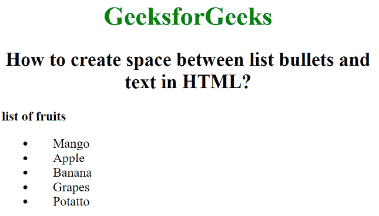

# 如何在 HTML 中的列表项目符号和文本之间创建空间？

> 原文:[https://www . geesforgeks . org/如何在列表项目符号和 html 文本之间创建空间/](https://www.geeksforgeeks.org/how-to-create-space-between-list-bullets-and-text-in-html/)

本文的方法是使用 CSS 在项目符号和文本之间创建一个空间。这个任务可以通过使用 **CSS** *左填充*属性**来完成。**用于设置元素左侧填充区域的宽度。

**语法:**

```html
padding-left: length|percentage|initial|inherit;
```

***例:***

## 超文本标记语言

```html
<!DOCTYPE html>
<html>

<head>
    <style>
        li {
            padding-left: 23px;
        }
    </style>
</head>

<body>
    <h1 style="color:green; 
        text-align:center">
        GeeksforGeeks
    </h1>

    <h2 style="text-align:center">
        How to create space between 
        list bullets and text in HTML?
    </h2>

    <!-- padding-left property used here -->
    <p><b>list of fruits</b></p>

    <ul>
        <li>Mango</li>
        <li>Apple</li>
        <li>Banana</li>
        <li>Grapes</li>
        <li>Potatto</li>
    </ul>
</body>

</html>
```

**输出:**



**支持的浏览器如下:**

*   谷歌 Chrome
*   微软公司出品的 web 浏览器
*   火狐浏览器
*   旅行队
*   歌剧