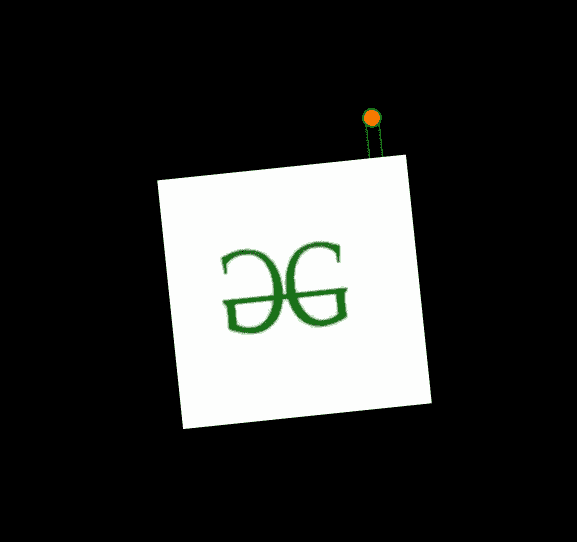

# 如何使用 HTML 和 CSS 创建摆动式的图像悬挂器？

> 原文:[https://www . geeksforgeeks . org/如何使用 html 和 css 创建摆动图像悬挂器/](https://www.geeksforgeeks.org/how-to-create-swinging-image-hanger-using-html-and-css/)

在本文中，我们将学习如何使用 HTML 和 CSS 创建一种经历摆动运动的图像悬挂器。这可用于增加页面的交互性或突出显示图像以引起注意。

**进场:**

*   我们将首先创建一个 HTML 文件，其中我们将为我们的图像衣架添加一个图像。
*   然后，我们将创建一个 CSS 样式，为包含图像的元素赋予动画效果。

我们将从定义页面的 HTML 和 CSS 部分开始，如下所示。

**HTML 部分:**在这个部分，定义了页面的结构。

*   我们将首先创建一个 HTML 文件。
*   然后，我们将写出 HTML 页面所需的样板代码。
*   我们接下来将链接 CSS 文件或直接添加提供所有动画效果的所需 CSS。
*   在正文部分，我们将添加一个图像源，以便显示我们的图像。

## index.html

```html
<html>
<head>
    <link rel="stylesheet"
          href="style.css">
</head>
<body>
    <div class="main_box">
        
    </div>
</body>
</html>
```

**CSS 部分:**在这一部分，我们将定义页面的 CSS。使用 CSS，我们将为我们的 HTML 页面提供不同类型的动画和效果，以便它看起来对所有用户都是交互式的。

*   我们将首先重置所有浏览器效果，以便所有浏览器上的一切都是一致的。
*   然后我们将定义给元素的样式，包括大小和位置。
*   我们将使用[@关键帧](https://www.geeksforgeeks.org/css-animation-and-keyframes-property/)和[伪类](https://www.geeksforgeeks.org/css-pseudo-classes/)为特定类添加动画效果。

**代码:**

## style.css

```html
  * {
    margin: 0;
    padding: 0;
    box-sizing: border-box;
  }

  /* In this part, we will define the characteristics
  of the body of the page and align the content */
  body {
    display: flex;
    justify-content: center;
    align-items: center;
    background-color: #000;
  }

  /* In this part, we will position and set the image
  in the page */
  .main_box {
    margin-top: 15em;
    margin-left: 15em;
    width: 22em;
    position: relative;
    transform: center -5em;

    /* We will the animation defined below to
       this element */
    animation: move infinite 0.5s alternate ease-in-out;
  }

  .main_box::before {
    content: "";
    width: 0.75em;
    height: 0.75em;
    position: absolute;
    left: 50%;
    top: -20%;
    transform: translateX(-50%);
    border: 0.125em solid rgb(6, 108, 9);
    border-radius: 50%;
    background-color: #ff7a00;
  }

  .main_box::after {
    content: "";
    position: absolute;
    width: 0.5em;
    height: 5em;
    border-radius: 0.75em;
    left: 50%;
    top: -20%;
    transform: translateX(-50%);
    border: 0.125em solid rgb(6, 108, 9);
    position: fixed;

    /* The z-index of -2 is set to keep the object of 
      ::after pseudo-class to beneath the other objects
    */
    z-index: -2;
  }

  /* @keyframes is used to add the swinging
     animation to our code! */

  @keyframes move {
    from {
      transform: rotate(-6deg);
    }
    to {
      transform: rotate(6deg);
    }
  }
</style>
```

**输出:**

