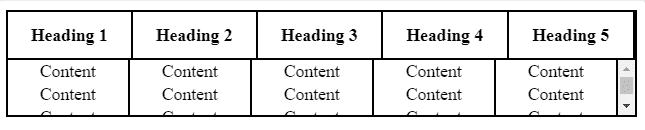

# 如何在 HTML 中创建 100%宽度，表体内部垂直滚动的表格？

> 原文:[https://www . geeksforgeeks . org/如何创建宽度为 100、垂直滚动的 html 表格正文/](https://www.geeksforgeeks.org/how-to-create-table-with-100-width-with-vertical-scroll-inside-table-body-in-html/)

本文的方法是使用 width 属性创建 100%宽度的表，并使用 overflow-y 属性在表体内部创建垂直滚动。溢出属性用于在表中创建滚动条。使用显示:块；属性来显示块级元素。由于更改了 tbody 的显示属性，所以我们也应该更改 ad 元素的属性，以防止破坏表格布局。

**示例:**

```html
<!DOCTYPE html>
<html>

<head>
    <title>
        Display table with vertical scrollbar
    </title>

    <style>
        table.scrolldown {
            width: 100%;

            /* border-collapse: collapse; */
            border-spacing: 0;
            border: 2px solid black;
        }

        /* To display the block as level element */
        table.scrolldown tbody, table.scrolldown thead {
            display: block;
        } 

        thead tr th {
            height: 40px; 
            line-height: 40px;
        }

        table.scrolldown tbody {

            /* Set the height of table body */
            height: 50px; 

            /* Set vertical scroll */
            overflow-y: auto;

            /* Hide the horizontal scroll */
            overflow-x: hidden; 
        }

        tbody { 
            border-top: 2px solid black;
        }

        tbody td, thead th {
            width : 200px;
            border-right: 2px solid black;
        }
        td {
            text-align:center;
        }
    </style>
</head>

<body>
    <table class="scrolldown">

        <!-- Table head content -->
        <thead>
            <tr>
                <th>Heading 1</th>
                <th>Heading 2</th>
                <th>Heading 3</th>
                <th>Heading 4</th>
                <th>Heading 5</th>
            </tr>
        </thead>

        <!-- Table body content -->
        <tbody>
            <tr>
                <td>Content</td>
                <td>Content</td>
                <td>Content</td>
                <td>Content</td>
                <td>Content</td>
            </tr>

            <tr>
                <td>Content</td>
                <td>Content</td>
                <td>Content</td>
                <td>Content</td>
                <td>Content</td>
            </tr>
            <tr>
                <td>Content</td>
                <td>Content</td>
                <td>Content</td>
                <td>Content</td>
                <td>Content</td>
            </tr>
        </tbody>
    </table>
<body>

</html>                    
```

**输出:**
