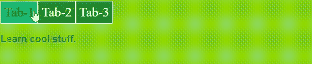

# 如何在 HTML 中创建包含不同内容的标签页？

> 原文:[https://www . geesforgeks . org/如何创建包含不同 html 内容的标签/](https://www.geeksforgeeks.org/how-to-create-tabs-containing-different-content-in-html/)

选项卡用于导航和显示网站的不同内容。我们使用标签来管理空间，使网站更有吸引力。

**进场:**

*   在[主体](https://www.geeksforgeeks.org/html-body-tag/)标签中，在 div 标签下创建一些标签，标签上有一个[自定义数据属性](https://www.geeksforgeeks.org/html-data-attributes/#:~:text=Custom%20Data%20Attributes%20allow%20you,our%20own%20custom%20data%20attributes.)，用于保存内容的 id。
*   创建另一个 [div](https://www.geeksforgeeks.org/div-tag-html/) 标签，用特定的 id 存储标签的内容。
*   为每个内容标签指定数据属性，一次只显示一个标签内容。
*   使用 [JavaScript](https://www.geeksforgeeks.org/javascript-tutorial/) 我们可以使用标签的 id 来显示标签的内容。

在本文中，我们创建了三个选项卡:选项卡 1、选项卡 2 和选项卡 3。当我们单击任何特定的选项卡时，它将显示该选项卡的内容。

**注意:**对于 [CSS](https://www.geeksforgeeks.org/css-tutorials/) ，参考样式标签下的代码，对于 JavaScript，参考脚本标签下的代码。

**示例:**在本例中，我们将创建包含不同内容的选项卡。

## 超文本标记语言

```html
<!DOCTYPE html>
<html lang="en">

<head>
    <style>
        body {
            background: rgb(140, 214, 30);
        }

        [data-tab-info] {
            display: none;
        }

        .active[data-tab-info] {
            display: block;
        }

        .tab-content {
            font-size: 30px;
            font-family: sans-serif;
            font-weight: bold;
            color: rgb(82, 75, 75);
        }

        .tabs {
            font-size: 40px;
            color: rgb(255, 255, 255);
            display: flex;
            margin: 0;
        }

        .tabs span {
            background: rgb(28, 145, 38);
            padding: 10px;
            border: 1px solid rgb(255, 255, 255);
        }

        .tabs span:hover {
            background: rgb(29, 185, 112);
            cursor: pointer;
            color: black;
        }
    </style>
</head>

<body>
    <div class="tabs">
        <span data-tab-value="#tab_1">Tab-1</span>
        <span data-tab-value="#tab_2">Tab-2</span>
        <span data-tab-value="#tab_3">Tab-3</span>
    </div>

    <div class="tab-content">
        <div class="tabs__tab active" id="tab_1" data-tab-info>
            <p>Welcome to GeeksforGeek.</p>

        </div>
        <div class="tabs__tab" id="tab_2" data-tab-info>
            <p>Hello Everyone.</p>

        </div>
        <div class="tabs__tab" id="tab_3" data-tab-info>
            <p>Learn cool stuff.</p>

        </div>
    </div>
    <script type="text/javascript">
        const tabs = document.querySelectorAll('[data-tab-value]')
        const tabInfos = document.querySelectorAll('[data-tab-info]')

        tabs.forEach(tab => {
            tab.addEventListener('click', () => {
                const target = document
                    .querySelector(tab.dataset.tabValue);

                tabInfos.forEach(tabInfo => {
                    tabInfo.classList.remove('active')
                })
                target.classList.add('active');
            })
        })
    </script>
</body>

</html>
```

**输出:**当我们点击标签-1 时，它显示的标签-1 的内容与标签-2 和标签-3 相同。

