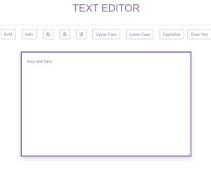

# 如何使用 Javascript 和 HTML 创建文本编辑器？

> 原文:[https://www . geesforgeks . org/如何使用 javascript 和 html-dom 创建文本编辑器/](https://www.geeksforgeeks.org/how-to-create-text-editor-using-javascript-and-html-dom/)

**项目介绍:**在本文中，我们将学习如何制作一个简单的文本编辑器 JavaScript 应用程序，在这里我们可以以不同的风格操纵用户输入，编辑输入，大写等许多字符串操作。让我们看看实现。

**进场:**

*   创建 [**按钮**](https://www.geeksforgeeks.org/html-button-tag/) 对 div 中的文本进行操作。
*   使用 [**文本区域标签**](https://www.geeksforgeeks.org/html-textarea-tag/) 在 div 中创建文本区域。
*   使用 [**文档. getElementById 方法**](https://www.geeksforgeeks.org/html-dom-getelementbyid-method/) 选择元素。
*   然后用 JavaScript 改变 CSS。

## index.html

```html
<!DOCTYPE html>
<html lang="en" dir="ltr">

<head>
    <meta charset="utf-8">
    <title>Text Editor</title>
    <!--Bootstrap Cdn -->
    <link rel="stylesheet" 
          href=
"https://cdn.jsdelivr.net/npm/bootstrap@4.5.3/dist/css/bootstrap.min.css" 
          integrity=
"sha384-TX8t27EcRE3e/ihU7zmQxVncDAy5uIKz4rEkgIXeMed4M0jlfIDPvg6uqKI2xXr2" 
          crossorigin="anonymous">
    <!-- fontawesome cdn For Icons -->
    <link rel="stylesheet"
          href=
"https://cdnjs.cloudflare.com/ajax/libs/font-awesome/5.10.0/css/all.min.css" 
          integrity=
"sha512-PgQMlq+nqFLV4ylk1gwUOgm6CtIIXkKwaIHp/PAIWHzig/lKZSEGKEysh0TCVbHJXCLN7WetD8TFecIky75ZfQ==" 
          crossorigin="anonymous" />
    <link rel="stylesheet"
          href=
"https://pro.fontawesome.com/releases/v5.10.0/css/all.css" 
          integrity=
"sha384-AYmEC3Yw5cVb3ZcuHtOA93w35dYTsvhLPVnYs9eStHfGJvOvKxVfELGroGkvsg+p"
          crossorigin="anonymous" />

    <!--Internal CSS start-->
    <style>
        h1 {
            padding-top: 40px;
            padding-bottom: 40px;
            text-align: center;
            color: #957dad;
            font-family: 'Montserrat', sans-serif;
        }

        section {
            padding: 5%;
            padding-top: 0;
            height: 100vh;
        }

        .side {
            margin-left: 0;
        }

        button {
            margin: 10px;
            border-color: #957dad !important;
            color: #888888 !important;
            margin-bottom: 25px;
        }

        button:hover {
            background-color: #fec8d8 !important;
        }

        textarea {
            padding: 3%;
            border-color: #957dad;
            border-width: thick;
        }

        .flex-box {
            display: flex;
            justify-content: center;
        }
    </style>
    <!--Internal CSS End-->
</head>
<!--Body start-->

<body>
    <section class="">
        <h1 class="shadow-sm">TEXT EDITOR</h1>
        <div class="flex-box">
            <div class="row">
                <div class="col">
                    <!-- Adding different buttons for
                         different functionality-->
                    <!--onclick attribute is added to give 
                        button a work to do when it is clicked-->
                    <button type="button" 
                            onclick="f1()" 
                            class=" shadow-sm btn btn-outline-secondary" 
                            data-toggle="tooltip"
                            data-placement="top" 
                            title="Bold Text">
            Bold</button>
                    <button type="button" 
                            onclick="f2()" 
                            class="shadow-sm btn btn-outline-success" 
                            data-toggle="tooltip" 
                            data-placement="top" 
                            title="Italic Text">
            Italic</button>
                    <button type="button" 
                            onclick="f3()" 
                            class=" shadow-sm btn btn-outline-primary" 
                            data-toggle="tooltip" 
                            data-placement="top"
                            title="Left Align">
            <i class="fas fa-align-left"></i></button>
                    <button type="button" 
                            onclick="f4()" 
                            class="btn shadow-sm btn-outline-secondary" 
                            data-toggle="tooltip" 
                            data-placement="top" 
                            title="Center Align">
            <i class="fas fa-align-center"></i></button>
                    <button type="button" 
                            onclick="f5()" 
                            class="btn shadow-sm btn-outline-primary" 
                            data-toggle="tooltip" 
                            data-placement="top" 
                            title="Right Align">
            <i class="fas fa-align-right"></i></button>
                    <button type="button" 
                            onclick="f6()" 
                            class="btn shadow-sm btn-outline-secondary" 
                            data-toggle="tooltip" 
                            data-placement="top" 
                            title="Uppercase Text">
            Upper Case</button>
                    <button type="button" 
                            onclick="f7()" 
                            class="btn shadow-sm btn-outline-primary" 
                            data-toggle="tooltip" 
                            data-placement="top" 
                            title="Lowercase Text">
            Lower Case</button>
                    <button type="button" 
                            onclick="f8()" 
                            class="btn shadow-sm btn-outline-primary" 
                            data-toggle="tooltip" 
                            data-placement="top" 
                            title="Capitalize Text">
            Capitalize</button>
                    <button type="button" 
                            onclick="f9()" 
                            class="btn shadow-sm btn-outline-primary side" 
                            data-toggle="tooltip" 
                            data-placement="top" 
                            title="Tooltip on top">
            Clear Text</button>
                </div>
            </div>
        </div>
        <br>
        <div class="row">
            <div class="col-md-3 col-sm-3">
            </div>
            <div class="col-md-6 col-sm-9">
                <div class="flex-box">
                    <textarea id="textarea1" 
                              class="input shadow" 
                              name="name" 
                              rows="15" 
                              cols="100" 
                              placeholder="Your text here ">
                    </textarea>
                </div>
            </div>
            <div class="col-md-3">
            </div>
        </div>
    </section>
    <br>
    <br>
    <h6 style="text-align:center;">Priyansh Jha 2021.</h6>

    <!--External JavaScript file-->
    <script src="home.js"></script>
</body>

</html>
```

**HTML 代码说明:**这里我们在文档中添加了不同的按钮，这些按钮将获得在 JavaScript 的帮助下执行一些我们赋予它的任务的能力。我们添加了用于更改输入字符串的字体粗细、字体样式、字符串的文本对齐方式的按钮，并将使用文档对象模型来转换字符串。我们添加了一些基本的 CSS 来美化文档，您可以使用不同的 CSS 属性来使它看起来更好。在 HTML 代码的下面部分，我们添加了一个文本字段，用户可以在其中写下输入字符串。因此，我们已经准备好了项目的所有设计和结构，现在我们需要做的就是使用 JavaScript 赋予它权力。对于，现在我们有一个文本框和多个按钮，用于在字符串输入中应用不同的样式。

## home.js

```html
function f1() {
    //function to make the text bold using DOM method
    document.getElementById("textarea1").style.fontWeight = "bold";
}

function f2() {
    //function to make the text italic using DOM method
    document.getElementById("textarea1").style.fontStyle = "italic";
}

function f3() {
    //function to make the text alignment left using DOM method
    document.getElementById("textarea1").style.textAlign = "left";
}

function f4() {
    //function to make the text alignment center using DOM method
    document.getElementById("textarea1").style.textAlign = "center";
}

function f5() {
    //function to make the text alignment right using DOM method
    document.getElementById("textarea1").style.textAlign = "right";
}

function f6() {
    //function to make the text in Uppercase using DOM method
    document.getElementById("textarea1").style.textTransform = "uppercase";
}

function f7() {
    //function to make the text in Lowercase using DOM method
    document.getElementById("textarea1").style.textTransform = "lowercase";
}

function f8() {
    //function to make the text capitalize using DOM method
    document.getElementById("textarea1").style.textTransform = "capitalize";
}

function f9() {
    //function to make the text back to normal by removing all the methods applied 
    //using DOM method
    document.getElementById("textarea1").style.fontWeight = "normal";
    document.getElementById("textarea1").style.textAlign = "left";
    document.getElementById("textarea1").style.fontStyle = "normal";
    document.getElementById("textarea1").style.textTransform = "capitalize";
    document.getElementById("textarea1").value = " ";
}
```

**JavaScript 代码解释:**
这里我们使用 DOM 选择元素。然后我们使用 **document.getElementById 方法**选择一个特定的元素，然后在使用它的 Id 名称选择特定的元素之后，我们通过 JavaScript 操作它的 CSS。最后，我们创建了一个函数，使一切恢复正常，在这里放弃所有的属性应用我们提供的按钮。

**输出:**

[](https://priyansh74.github.io/TextEditor/)

输出屏幕图像

你可以在这个项目中添加更多的功能，比如改变字体大小、计算字母数量、文本区域内的单词、改变字体样式等等。一定要试一试。
可以从 [**Github**](https://github.com/priyansh74/TextEditor) 访问源代码，点击这里 可以看到这个项目的运行示例。