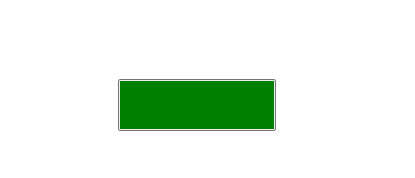

# 如何使用 HTML 和 CSS 为按钮创建文本显示效果？

> 原文:[https://www . geesforgeks . org/如何使用 html 和 css 为按钮创建文本显示效果/](https://www.geeksforgeeks.org/how-to-create-text-reveal-effect-for-buttons-using-html-and-css/)

按钮是任何网站最重要的用户界面组件。以创造性的独特方式设计按钮非常重要。按钮的*文本显示*效果用于显示一些优惠或激动人心的内容，以增强用户体验。

**方法:**方法是用一个与按钮尺寸相同的长条覆盖按钮，然后在鼠标悬停时将其移动到任何方向。

**HTML 代码:**下面的代码片段实现了按钮的创建。

```html
<!DOCTYPE html>
<html lang="en">
  <head>
    <meta charset="UTF-8" />
    <meta name="viewport" content=
        "width=device-width, initial-scale=1.0" />
    <title>Text Reveal Effect for Buttons</title>
  </head>
  <body>
    <button>GeeksforGeeks</button>
  </body>
</html>
```

**CSS 代码:**

*   **第一步:**对按钮应用一些基本的造型，比如添加*填充*和*边框半径*以具有圆角。
*   **步骤 2:** 现在使用选择器之前的[创建一个相同尺寸的条来覆盖整个按钮。](https://www.geeksforgeeks.org/css-before-selector/)
*   **第 3 步:**现在使用*悬停*选择器将条移动到任意一个方向，因为它在示例中向左移动。

**注意:**可以根据需要任意方向移动长条。你也可以使用一些其他的属性来调整效果。

```html
<style>
    button {
        position: absolute;
        top: 50%;
        left: 50%;
        font-size: 20px;
        padding: 15px;
    }

    button::before {
        content: "";
        position: absolute;
        top: 0%;
        left: 0%;
        width: 100%;
        height: 100%;
        background: green;
        transition: 0.5s ease-in-out;
    }

    button:hover::before {
        left: -100%;
    }
</style>
```

**完整代码:**是以上两段代码的组合。

```html
<!DOCTYPE html>
<html lang="en">

<head>
    <meta charset="UTF-8" />
    <meta name="viewport" content=
        "width=device-width, initial-scale=1.0" />

    <title>
        Text Reveal Effect for Buttons
    </title>

    <style>
        button {
            position: absolute;
            top: 50%;
            left: 50%;
            font-size: 20px;
            padding: 15px;
        }

        button::before {
            content: "";
            position: absolute;
            top: 0%;
            left: 0%;
            width: 100%;
            height: 100%;
            background: green;
            transition: 0.5s ease-in-out;
        }

        button:hover::before {
            left: -100%;
        }
    </style>
</head>

<body>
    <button>GeeksforGeeks</button>
</body>

</html>
```

**输出:**
