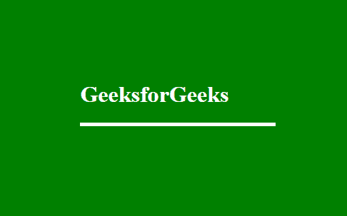
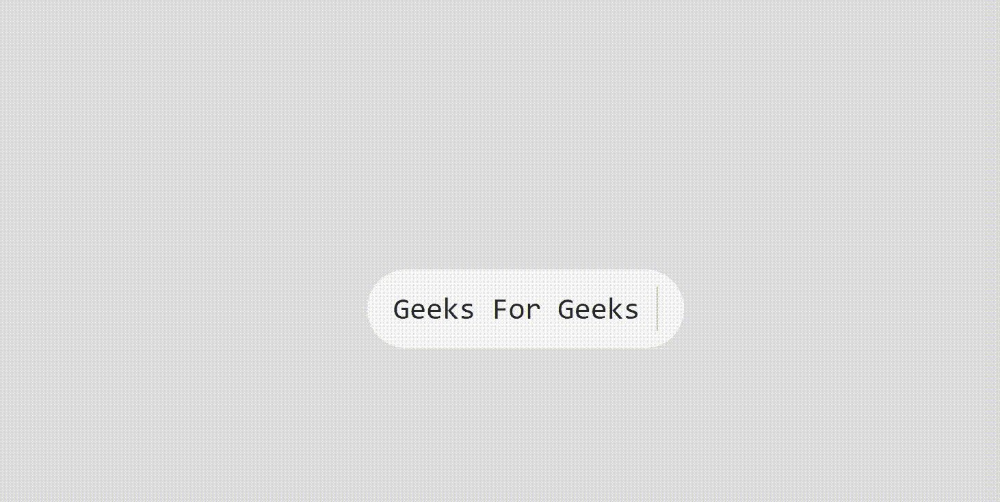

# 如何使用 HTML 和 CSS 创建文本展示效果？

> 原文:[https://www . geesforgeks . org/如何使用 html 和 css 创建文本显示效果/](https://www.geeksforgeeks.org/how-to-create-text-reveal-effect-using-html-and-css/)

文本显示是一种效果，其中所有文本的字母都以某种动画方式一个接一个地显示出来。有无数种方法可以使文本产生动画效果。你的创造力决定了你希望文章如何揭示。我们将研究一种简单易行的入门方法。
**方法:**方法是使用[关键帧](https://www.geeksforgeeks.org/css-keyframes-rule/)来制作帧动画，以逐帧方式缓慢显示文本。
**HTML 代码:**在 HTML 中，我们使用了包装在< div >标签中的< h1 >标签。

## 超文本标记语言

```html
<!DOCTYPE html>
<html lang="en">

<head>
    <meta charset="UTF-8">
    <meta name="viewport" content=
        "width=device-width, initial-scale=1.0">
    <title>Text Reveal Animation</title>
</head>

<body>
    <div class="geeks">
        <h1>GeeksforGeeks</h1>
    </div>
</body>

</html>
```

**CSS 代码:**对于 CSS，请按照以下步骤操作:

*   **第一步:**首先我们做了一些基本的造型，比如提供背景色，对齐文本到中心等。
*   **第二步:**然后使用[动画](https://www.geeksforgeeks.org/css-animations/)属性，标识符命名为*动画*。
*   **步骤 3:** 现在使用关键帧为每一帧设置动画，并为每一帧设置不同的高度和宽度。

**提示:**您可以更改每一帧中使用的高度和宽度值，以不同的方式显示文本。

## 半铸钢ˌ钢性铸铁(Cast Semi-Steel)

```html
<style>
    body {
        background: green;
    }

    .geeks {
        width: 20%;
        top: 50%;
        position: absolute;
        left: 40%;
        border-bottom: 5px solid white;
        overflow: hidden;
        animation: animate 2s linear forwards;
    }

    .geeks h1 {
        color: white;
    }

    @keyframes animate {
        0% {
            width: 0px;
            height: 0px;
        }
        30% {
            width: 50px;
            height: 0px;
        }
        60% {
            width: 50px;
            height: 80px;
        }
    }
</style>
```

**完整代码:**是以上两段代码的组合。

## 超文本标记语言

```html
<!DOCTYPE html>
<html lang="en">

<head>
    <meta charset="UTF-8">
    <meta name="viewport" content=
        "width=device-width, initial-scale=1.0">
    <title>Text Reveal Animation</title>

    <style>
        body {
            background: green;
        }

        .geeks {
            width: 20%;
            top: 50%;
            position: absolute;
            left: 40%;
            border-bottom: 5px solid white;
            overflow: hidden;
            animation: animate 2s linear forwards;
        }

        .geeks h1 {
            color: white;
        }

        @keyframes animate {
            0% {
                width: 0px;
                height: 0px;
            }
            30% {
                width: 50px;
                height: 0px;
            }
            60% {
                width: 50px;
                height: 80px;
            }
        }
    </style>
</head>

<body>
    <div class="geeks">
        <h1>GeeksforGeeks</h1>
    </div>
</body>

</html>
```

**输出:**



又一个动画方法

**HTML 代码:**下面的代码片段创建了一个 HTML div 元素，其中包含要修改的文本。

## 超文本标记语言

```html
<!DOCTYPE html>
<html lang="en">
<head>
    <meta charset="UTF-8">
    <title>Collecting Data</title>
    <link rel="stylesheet" href="https://cdn.jsdelivr.net/npm/bootstrap@4.5.3/dist/css/bootstrap.min.css" integrity="sha384-TX8t27EcRE3e/ihU7zmQxVncDAy5uIKz4rEkgIXeMed4M0jlfIDPvg6uqKI2xXr2" crossorigin="anonymous">

</head>
<body class="container" style="margin-top: 50px; width: 50% height:auto; ">

<div class="text-typing">

<p>Geeks For Geeks </p>

</div>
</html>
```

**CSS 代码:**对于 CSS，请遵循以下步骤:

第一步:首先，我们已经做了一些基本的造型，比如提供背景色，对齐项目到中心，等等。

第二步:然后使用标识符为文本输入 p 的动画属性

步骤 3:现在使用关键帧从宽度 0 到 100%制作动画..

## 超文本标记语言

```html
<style >
      body {
  margin:0px;
  height:100vh;
  display:flex;
  align-items:center;
  justify-content:center;
  background:#ddd;
}
.text-typing {
  padding:20px 30px;
  background:#f5f5f5;
  font-size:35px;
  font-family:monospace;
  border-radius:50px;
}
.text-typing p {
  margin:0px;
  white-space:nowrap;
  overflow:hidden;
  animation:typing 4s steps(22,end) forwards,
            blink 1s infinite;
}
@keyframes typing {
  0% { width:0% }
  100% { width:100% }
}
@keyframes blink {
  0%,100% {
    border-right:2px solid transparent;
  }
  50% {
    border-right:2px solid #222;
  }
}

    </style>
```

**完整代码:**是以上两段代码的组合。

## 超文本标记语言

```html
<!DOCTYPE html>
<html lang="en">
<head>
    <meta charset="UTF-8">
    <title>Collecting Data</title>
    <link rel="stylesheet" href="https://cdn.jsdelivr.net/npm/bootstrap@4.5.3/dist/css/bootstrap.min.css" integrity="sha384-TX8t27EcRE3e/ihU7zmQxVncDAy5uIKz4rEkgIXeMed4M0jlfIDPvg6uqKI2xXr2" crossorigin="anonymous">
    <style >
      body {
  margin:0px;
  height:100vh;
  display:flex;
  align-items:center;
  justify-content:center;
  background:#ddd;
}
.text-typing {
  padding:20px 30px;
  background:#f5f5f5;
  font-size:35px;
  font-family:monospace;
  border-radius:50px;
}
.text-typing p {
  margin:0px;
  white-space:nowrap;
  overflow:hidden;
  animation:typing 4s steps(22,end) forwards,
            blink 1s infinite;
}
@keyframes typing {
  0% { width:0% }
  100% { width:100% }
}
@keyframes blink {
  0%,100% {
    border-right:2px solid transparent;
  }
  50% {
    border-right:2px solid #222;
  }
}

    </style>
</head>
<body class="container" style="margin-top: 50px; width: 50% height:auto; ">

<div class="text-typing">

<p>Geeks For Geeks </p>

</div>
</html>
```

**输出**

