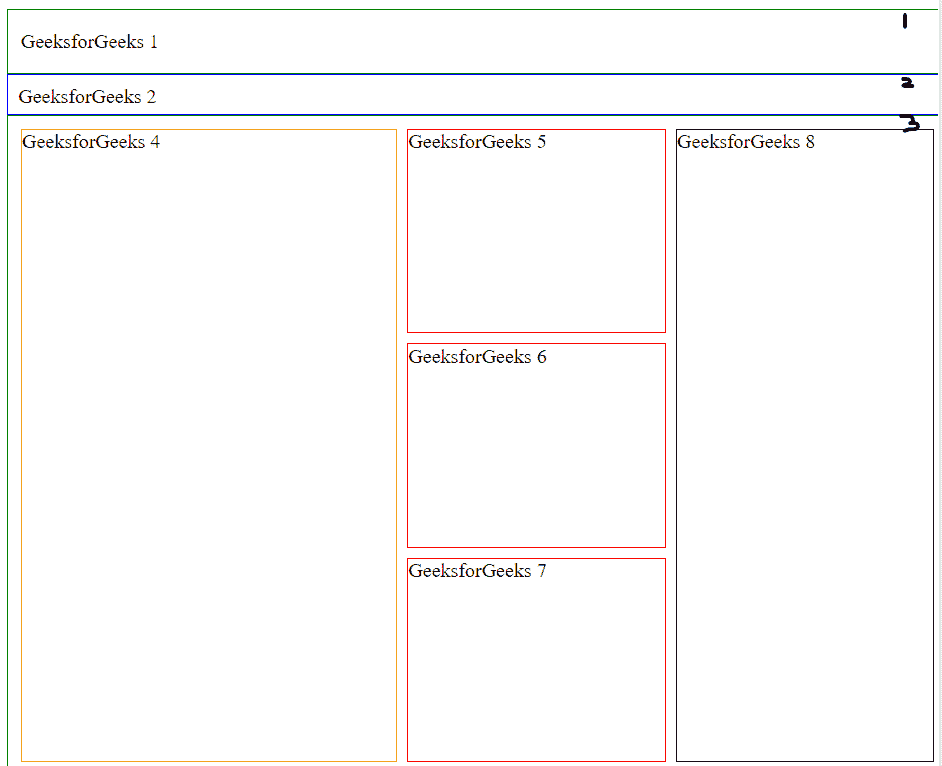

# 如何使用 HTML 和 CSS 在同一个 div 中创建三个框？

> 原文:[https://www . geeksforgeeks . org/如何使用 html 和 css 创建同一个 div 中的三个框/](https://www.geeksforgeeks.org/how-to-create-three-boxes-in-the-same-div-using-html-and-css/)

三个或三个以上不同的 div 可以在同一个 div 中使用 CSS 并排放置。这可以通过 flexbox 来实现，但请注意，您需要使用包装 div，并对每个包装应用不同的 flex 方向，以使网格布局正常工作。使用 CSS 属性设置 div 的高度和宽度。

**语法:**

```html
flex: flex-grow flex-shrink flex-basis 
           | auto | initial | inherit;
flex-direction: row;
flex-direction: row-reverse;
flex-direction: column;
flex-direction: column-reverse;
flex-grow: number | initial | inherit;
```

**示例:**这个示例说明了如何用常规的 HTML 和 CSS 在同一个 div 中创建 3 个框。

```html
<!DOCTYPE html>
<html lang='en'>

<head>
    <meta charset="utf-8">

    <title>
        How to create 3 boxes 
        in the same div using
        HTML and CSS ?
    </title>

    <style>
        body,
        html {
            height: 100%;
            width: 100%;
            overflow: hidden;
        }

        .box-wrapper {
            height: 100vh;
            width: 100vw;
            display: flex;
            flex-direction: column;
        }

        #box1 {
            padding: 10px;
            height: 30px;
            line-height: 30px;
            border: solid 1px green
        }

        #box2 {
            height: 15px;
            padding: 8px;
            border: solid 1px blue
        }

        #box3 {
            padding: 10px;
            flex-grow: 1;
            display: flex;
            flex-direction: row;
            border: solid 1px green
        }

        #box4 {
            flex-grow: 2;
            border: solid 1px orange
        }

        .middle-column {
            flex-grow: 1;
            display: flex;
            flex-direction: column;

        }

        .middle-column div {
            flex-grow: 1;
            margin: 0 8px;
            border: solid 1px red;
        }

        .middle-column div+div {
            margin-top: 8px
        }

        #box8 {
            flex-grow: 1;
            border: solid 1px black
        }
    </style>
</head>

<body>
    <div class="box-wrapper">
        <div id="box1">
            GeeksforGeeks 1
        </div>

        <div id="box2">
            GeeksforGeeks 2
        </div>

        <div id="box3">
            <div id="box4">
                GeeksforGeeks 4
            </div>
            <div class="middle-column">
                <div id="box5">
                    GeeksforGeeks 5
                </div>
                <div id="box6">
                    GeeksforGeeks 6
                </div>
                <div id="box7">
                    GeeksforGeeks 7
                </div>
            </div>
            <div id="box8">
                GeeksforGeeks 8
            </div>
        </div>
    </div>
</body>

</html>
```

```html
Output:

```

[](https://media.geeksforgeeks.org/wp-content/uploads/20200516093029/output.png)