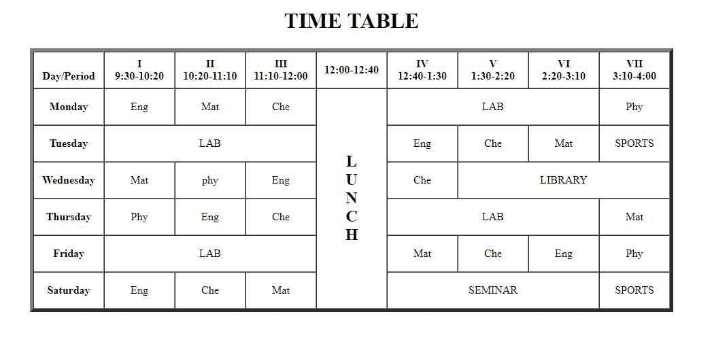

# 如何用 HTML 创建时间表日程？

> 原文:[https://www . geesforgeks . org/如何使用 html 创建时间表-日程/](https://www.geeksforgeeks.org/how-to-create-time-table-schedule-using-html/)

A [表](https://www.geeksforgeeks.org/html-tables/)是行和列的排列。任何人都可以通过了解 HTML(超文本标记语言)的基础知识来创建表格。使用 HTML 中的<表格>标签来定义表格。

创建表格的步骤:

1.  创建一个标签。
2.  使用标签

    创建表格。
3.  使用在表格中创建行。这是行标签。
4.  使用表格数据标签将数据插入行中。
5.  关闭表格标签。
6.  关闭 html 标签

这是用 HTML 创建的基本时间表，没有使用字体颜色和背景颜色。

**示例:**

```html
<!DOCTYPE html>
<html>

<body>
    <h1>TIME TABLE</h1>
    <table border="5" cellspacing="0" align="center">
        <!--<caption>Timetable</caption>-->
        <tr>
            <td align="center" height="50" 
                width="100"><br>
                <b>Day/Period</b></br>
            </td>
            <td align="center" height="50" 
                width="100">
                <b>I<br>9:30-10:20</b>
            </td>
            <td align="center" height="50" 
                width="100">
                <b>II<br>10:20-11:10</b>
            </td>
            <td align="center" height="50" 
                width="100">
                <b>III<br>11:10-12:00</b>
            </td>
            <td align="center" height="50" 
                width="100">
                <b>12:00-12:40</b>
            </td>
            <td align="center" height="50" 
                width="100">
                <b>IV<br>12:40-1:30</b>
            </td>
            <td align="center" height="50" 
                width="100">
                <b>V<br>1:30-2:20</b>
            </td>
            <td align="center" height="50" 
                width="100">
                <b>VI<br>2:20-3:10</b>
            </td>
            <td align="center" height="50" 
                width="100">
                <b>VII<br>3:10-4:00</b>
            </td>
        </tr>
        <tr>
            <td align="center" height="50">
                <b>Monday</b></td>
            <td align="center" height="50">Eng</td>
            <td align="center" height="50">Mat</td>
            <td align="center" height="50">Che</td>
            <td rowspan="6" align="center" height="50">
                <h2>L<br>U<br>N<br>C<br>H</h2>
            </td>
            <td colspan="3" align="center" 
                height="50">LAB</td>
            <td align="center" height="50">Phy</td>
        </tr>
        <tr>
            <td align="center" height="50">
                <b>Tuesday</b>
            </td>
            <td colspan="3" align="center" 
                height="50">LAB
            </td>
            <td align="center" height="50">Eng</td>
            <td align="center" height="50">Che</td>
            <td align="center" height="50">Mat</td>
            <td align="center" height="50">SPORTS</td>
        </tr>
        <tr>
            <td align="center" height="50">
                <b>Wednesday</b>
            </td>
            <td align="center" height="50">Mat</td>
            <td align="center" height="50">phy</td>
            <td align="center" height="50">Eng</td>
            <td align="center" height="50">Che</td>
            <td colspan="3" align="center" 
                height="50">LIBRARY
            </td>
        </tr>
        <tr>
            <td align="center" height="50">
                <b>Thursday</b>
            </td>
            <td align="center" height="50">Phy</td>
            <td align="center" height="50">Eng</td>
            <td align="center" height="50">Che</td>
            <td colspan="3" align="center" 
                height="50">LAB
            </td>
            <td align="center" height="50">Mat</td>
        </tr>
        <tr>
            <td align="center" height="50">
                <b>Friday</b>
            </td>
            <td colspan="3" align="center" 
                height="50">LAB
            </td>
            <td align="center" height="50">Mat</td>
            <td align="center" height="50">Che</td>
            <td align="center" height="50">Eng</td>
            <td align="center" height="50">Phy</td>
        </tr>
        <tr>
            <td align="center" height="50">
                <b>Saturday</b>
            </td>
            <td align="center" height="50">Eng</td>
            <td align="center" height="50">Che</td>
            <td align="center" height="50">Mat</td>
            <td colspan="3" align="center" 
                height="50">SEMINAR
            </td>
            <td align="center" height="50">SPORTS</td>
        </tr>
    </table>
</body>

</html>
```

**输出:**



我们还可以添加字体颜色、背景颜色、背景图像等造型元素。到上面的时间表。可以添加到表中的属性有:

1.  **对齐:**左右居中对齐。
2.  **边框:**设置表格的边框(表格边框宽度)
3.  **bgcolor:** 设置单元格或整个表格的背景色。
4.  **列跨度:**设置要跨越的列数。
5.  **rowspan:** 设置要跨越的列数。
6.  **单元格间距:**在单元格之间创建空间。
7.  **单元格填充:**在单元格内创建空间。
8.  **背景:**用图像设置表格背景。
9.  **宽度:**设置表格的宽度。
10.  **高度:**设置桌子的高度。

HTML 是网页的基础，通过构建网站和网络应用程序用于网页开发。您可以通过以下 [HTML 教程](https://www.geeksforgeeks.org/html-tutorials/)和 [HTML 示例](https://www.geeksforgeeks.org/html-examples/)从头开始学习 HTML。

CSS 是网页的基础，通过设计网站和网络应用程序用于网页开发。你可以通过以下 [CSS 教程](https://www.geeksforgeeks.org/css-tutorials/)和 [CSS 示例](https://www.geeksforgeeks.org/css-examples/)从头开始学习 CSS。