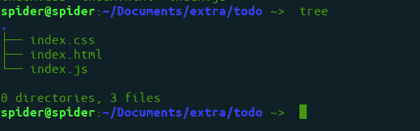
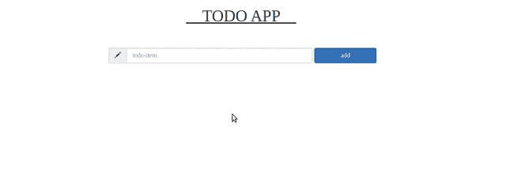

# 如何使用 HTML、CSS、JS 和 Bootstrap 创建 ToDo App？

> 原文:[https://www . geesforgeks . org/how-create-todo-app-using-html-CSS-js-and-bootstrap/](https://www.geeksforgeeks.org/how-to-create-todo-app-using-html-css-js-and-bootstrap/)

我们将创建一个基本的待办事项应用程序来理解 JavaScript 的基础知识。在这个 web 应用程序中，可以创建一个待办事项列表，并从列表中删除特定的元素。

**要实现的特性或功能:**

*   交互式和响应性设计
*   响应网格系统
*   存储和删除项目

**先决条件:**基本知识**[HTML](https://www.geeksforgeeks.org/html-tutorials/)****[CSS](https://www.geeksforgeeks.org/css-tutorials/)****[JavaScript](https://www.geeksforgeeks.org/javascript-tutorial/)****[jQuery](https://www.geeksforgeeks.org/jquery-tutorials/)**和 **[Bootstrap](https://www.geeksforgeeks.org/bootstrap-tutorials/)** 。另外，用户应该知道 Bootstrap 中的 **[网格系统是如何工作的。](https://www.geeksforgeeks.org/bootstrap-4-grid-system/)**

**设置:**为 HTML、CSS 和 JavaScript 创建三个文件。要创建这些文件，请运行以下命令:

*   **Syntax:**

    ```html
    $ touch index.html index.css index.js
    ```

    

*   **第一步:**现在编辑**index.html**文件。

    ```html
    <!DOCTYPE html>
    <html lang="en" dir="ltr">

    <head>
        <meta charset="utf-8">
        <title>todo</title>
        <link rel="stylesheet" href="style.css">

        <!-- Latest compiled and minified CSS -->
        <link rel="stylesheet" href=
    "https://maxcdn.bootstrapcdn.com/bootstrap/3.4.1/css/bootstrap.min.css">
    </head>

    <body>
        <div class="container">
            <h1 class="row">

              TODO APP 

            </h1>
            <br/><br/>
            <div class="row">
                <form class="form-inline col-sm-offset-3">
                    <div class="input-group">
                        <span class="input-group-addon">
                          <i class="glyphicon glyphicon-pencil"></i>
                        </span>
                        <input type="text" class="form-control"
                               placeholder="todo-item" 
                               id="box" style="width: 30vw" />
                    </div>
                    <div class="form-group">
                        <input type="button"
                               class="btn btn-primary form-control" 
                               value="add" style="width: 10vw"
                               onclick="add_item()" />
                    </div>
                </form>
            </div>
            <div class="row">
                <ul id="list_item">
                </ul>
            </div>
        </div>
        <script type="text/javascript" src="main.js"></script>
    </body>

    </html>
    ```

*   **第二步:**现在，给 **index.css** 文件添加一些 CSS 属性。

    ```html
    * {
        padding: 0;
        margin: 0;
        box-sizing: border-box;
        font-family: cursive;
      }

      body {
        background: #f2f2f2;
        overflow: auto;
      }

      h1{
         text-align: center;
         margin: 5%;
         font-size: 3rem;
         text-decoration: underline;
      }

      ul {
        text-align: lleft;
        padding-left: 10%;
        padding: 7%;
        font-size: 2rem;
        list-style: circle;
      }

      li:hover{
        color:red;
        margin: 4%;
        transition: 1.5s ease;
        cursor: pointer;
      }

    ```

*   **第三步:**编辑 **index.js** 文件，增加一些功能。

    ```html
    // Function called while clicking add button
    function add_item() {

      // Getting box and ul by selecting id;
      let item = document.getElementById("box");
      let list_item = document.getElementById("list_item");
      if(item.value != ""){

          // Creating element and adding value to it
          let make_li = document.createElement("LI");
          make_li.appendChild(document.createTextNode(item.value));

          // Adding li to ul
          list_item.appendChild(make_li);

          // Reset the value of box
          item.value=""

          // Delete a li item on click 
          make_li.onclick = function(){
            this.parentNode.removeChild(this);
          }

      }
      else{

        // Alert msg when value of box is "" empty.
        alert("plz add a value to item");
      }

    }
    ```

*   **输出:** 