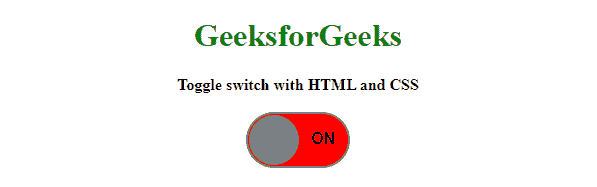
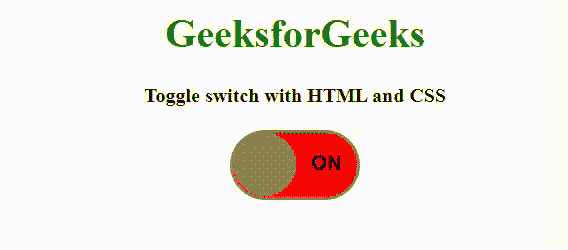

# 如何使用 HTML 和 CSS 创建切换开关？

> 原文:[https://www . geesforgeks . org/如何使用 html 和 css 创建切换开关/](https://www.geeksforgeeks.org/how-to-create-toggle-switch-by-using-html-and-css/)



要创建一个切换开关，我们将使用 HTML 和 CSS。如果你想添加一个更有吸引力的切换开关，那么你可以添加滑动动画，弹跳效果等。在本文中，我们将整个事情分为两个不同的部分**结构创建**和**结构设计**。

**创建结构:** 在本节中，我们将为切换按钮创建一个基本结构。在这里，我们只需要在 HTML 文档中添加一个复选框和一个标签，如下所示。我们可以通过使用 [**HTML 标签标签** 和](https://www.geeksforgeeks.org/html-label-tag/) [**HTML 输入类型=复选框来实现。**](https://www.geeksforgeeks.org/html-input-typecheckbox/)

**HTML 代码:** 该 HTML 代码用于创建一个拨动开关的结构。因为它不包含 CSS，所以它只是一个简单的结构。我们将使用一些 CSS 属性来使其具有吸引力。

## 超文本标记语言

```html
<!DOCTYPE html>
<html>

<head>
    <title>toggle switch</title>
</head>

<body>
    <center>
        <h1>GeeksforGeeks</h1>
        <b>Toggle switch with HTML and CSS</b>
        <br><br>
        <input type="checkbox" id="switch"
                    class="checkbox" />
        <label for="switch" class="toggle">

<p>OFF    ON</p>

        </label>
    </center>
</body>

</html>
```

**设计结构:**在上一节中，我们已经创建了拨动开关的结构。我们将在本节中设计开关并使其具有响应性。

*   **CSS 代码:** CSS 代码用来制作一个吸引人的 HTML 组件。此 CSS 属性用于在切换开关上制作样式。

## 半铸钢ˌ钢性铸铁(Cast Semi-Steel)

```html
<style>
    h1 {
        color: green;
    }

    /* toggle in label designing */
    .toggle {
        position : relative ;
        display : inline-block;
        width : 100px;
        height : 52px;
        background-color: red;
        border-radius: 30px;
        border: 2px solid gray;
    }

    /* After slide changes */
    .toggle:after {
        content: '';
        position: absolute;
        width: 50px;
        height: 50px;
        border-radius: 50%;
        background-color: gray;
        top: 1px; 
        left: 1px;
        transition:  all 0.5s;
    }

    /* Toggle text */
    p {
        font-family: Arial, Helvetica, sans-serif;
        font-weight: bold;
    }

    /* Checkbox checked effect */
    .checkbox:checked + .toggle::after {
        left : 49px; 
    }

    /* Checkbox checked toggle label bg color */
    .checkbox:checked + .toggle {
        background-color: green;
    }

    /* Checkbox vanished */
    .checkbox { 
        display : none;
    }
</style>
```

**结合 HTML 和 CSS 代码:**这是最后的代码，也就是上面两部分的结合。它将显示拨动开关。

## 超文本标记语言

```html
<!DOCTYPE html>
<html>

<head>
    <title>toggle switch</title>

    <style>
        h1 {
            color: green;
        }

        /* toggle in label designing */
        .toggle {
            position : relative ;
            display : inline-block;
            width : 100px;
            height : 52px;
            background-color: red;
            border-radius: 30px;
            border: 2px solid gray;
        }

        /* After slide changes */
        .toggle:after {
            content: '';
            position: absolute;
            width: 50px;
            height: 50px;
            border-radius: 50%;
            background-color: gray;
            top: 1px; 
            left: 1px;
            transition:  all 0.5s;
        }

        /* Toggle text */
        p {
            font-family: Arial, Helvetica, sans-serif;
            font-weight: bold;
        }

        /* Checkbox checked effect */
        .checkbox:checked + .toggle::after {
            left : 49px; 
        }

        /* Checkbox checked toggle label bg color */
        .checkbox:checked + .toggle {
            background-color: green;
        }

        /* Checkbox vanished */
        .checkbox { 
            display : none;
        }
    </style>
</head>

<body>
    <center>
        <h1>GeeksforGeeks</h1>
        <b>Toggle switch with HTML and CSS</b>
        <br><br>
        <input type="checkbox" id="switch"
                    class="checkbox" />
        <label for="switch" class="toggle">

<p>OFF    ON</p>

        </label>
    </center>
</body>

</html>
```

**输出:**



CSS 是网页的基础，通过设计网站和网络应用程序用于网页开发。你可以通过以下 [CSS 教程](https://www.geeksforgeeks.org/css-tutorials/)和 [CSS 示例](https://www.geeksforgeeks.org/css-examples/)从头开始学习 CSS。