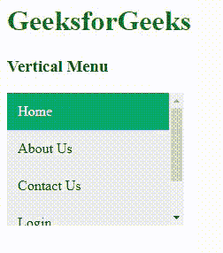

# 如何使用 HTML 和 CSS 创建垂直菜单？

> 原文:[https://www . geesforgeks . org/如何使用 html 和 css 创建垂直菜单/](https://www.geeksforgeeks.org/how-to-create-vertical-menu-using-html-and-css/)

**垂直菜单:**我们可以以按钮和可滚动菜单的形式创建一个垂直菜单。垂直菜单是排列在垂直菜单栏/导航栏中的按钮。

**如何使用按钮创建** **垂直菜单:**我们可以简单的使用 HTML 和 CSS 来创建。我们将通过使用[<div>](https://www.geeksforgeeks.org/div-tag-html/)[<Li>](https://www.geeksforgeeks.org/html-li-tag/)和 [< a >](https://www.geeksforgeeks.org/html-a-tag/) 标签来创建网页的简单结构。

**语法:**

```html
<div class="vertical-menu">
  <a href="#" class="active">Home</a>
  <a href="#">1</a>
  ...
  <a href="#">n</a>
</div>
```

**示例:**

## 超文本标记语言

```html
<!DOCTYPE html>
<html>

<head>
    <meta name="viewport" content=
        "width=device-width,initial-scale=1">

    <style>
        .vertical-menu {
            width: 200px;
        }

        .vertical-menu a {
            background-color: #eee;
            color: black;
            display: block;
            padding: 12px;
            text-decoration: none;
        }

        .vertical-menu a:hover {
            background-color: #ccc;
        }

        .vertical-menu a.active {
            background-color: #04AA6D;
            color: white;
        }
    </style>
</head>

<body>
    <h1 style="color:green;">
        GeeksforGeeks
    </h1>

    <h3>Vertical Menu</h3>

    <div class="vertical-menu">
        <a href="#" class="active">Home</a>
        <a href="#">About Us </a>
        <a href="#">Contact Us</a>
        <a href="#">Login </a>
        <a href="#">Sign Up</a>
    </div>
</body>

</html>
```

**输出:**


**如何使用可滚动创建** **a** **垂直菜单:**在这里，我们将看到如何使用可滚动创建垂直菜单。为了做到这一点，我们将使用简单的 HTML 和 CSS。

**语法:**

```html
<div class="vertical-menu">
    <a href="#" class="active">Home</a>
    <a href="#">1</a>
    ...
    <a href="#">n</a>
</div>
```

**示例:**

## 超文本标记语言

```html
<!DOCTYPE html>
<html>

<head>
    <meta name="viewport" content=
        "width=device-width,initial-scale=1">

    <style>
        .vertical-menu {
            width: 200px;
            height: 150px;
            overflow-y: auto;
        }

        .vertical-menu a {
            background-color: #eee;
            color: black;
            display: block;
            padding: 12px;
            text-decoration: none;
        }

        .vertical-menu a:hover {
            background-color: #ccc;
        }

        .vertical-menu a.active {
            background-color: #04AA6D;
            color: white;
        }
    </style>
</head>

<body>
    <h1 style="color:green; text-align: center;">
        GeeksforGeeks
    </h1>

    <h3>Vertical Menu</h3>

    <div class="vertical-menu">
        <a href="#" class="active">Home</a>
        <a href="#">About Us </a>
        <a href="#">Contact Us</a>
        <a href="#">Login </a>
        <a href="#">Sign Up</a>
    </div>
</body>

</html>
```

**输出:**

