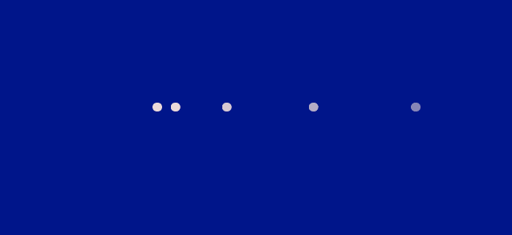
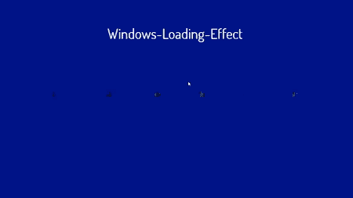

# 如何用 HTML 和 CSS 创建窗口加载效果？

> 原文:[https://www . geesforgeks . org/如何使用 html 和 css 创建窗口加载效果/](https://www.geeksforgeeks.org/how-to-create-windows-loading-effect-using-html-and-css/)

在本文中，我们将使用 HTML 和 CSS 在锁屏出现之前创建一个窗口加载效果。

**窗口加载效果的滑动:**


**进场:**

*   创建一个包含 HTML i div 的 HTML 文件，我们在其中赋予加载器效果。
*   然后我们创建 5 个[跨度](https://www.geeksforgeeks.org/span-tag-html/)元素，用于创建内联元素。
*   然后我们要用[@关键帧](https://www.geeksforgeeks.org/css-animation-and-keyframes-property/)来创建动画特征。
*   那么我们就要用[第 n 个子()属性](https://www.geeksforgeeks.org/css-nth-child-selector/)来选择不同的子。

**HTML 代码:**

*   首先，我们创建一个 HTML 文件(index.html)。
*   现在，在创建了我们的 HTML 文件之后，我们将使用<title>标签为我们的网页赋予一个标题。应该放在标签之间。</title>
*   我们将提供所有动画效果的 CSS 文件链接到我们的 HTML。这也放在标签之间。
*   现在我们从谷歌字体添加了一个链接，在我们的项目中使用不同类型的字体系列。
*   来到我们的 HTML 代码的主体部分。
*   然后，我们必须创建一个 div，在其中我们可以存储所有的标题部分和跨度标签。

## index.html

```html
<!DOCTYPE html>
<html lang="en">

<head>
    <link rel="stylesheet" href="style.css">
    <link rel="preconnect" href="https://fonts.gstatic.com">
    <link href=
"https://fonts.googleapis.com/css2?family=Dosis:wght@300&family=Hanalei&display=swap"
        rel="stylesheet">
</head>

<body>
    <h1>Windows-Loading-Effect</h1>
    <div class="container">
        <span></span>
        <span></span>
        <span></span>
        <span></span>
        <span></span>
    </div>
</body>

</html>
```

**CSS 代码:** CSS 用来给我们的 HTML 页面赋予不同类型的动画和效果，让所有用户看起来都是交互式的。

*   恢复所有浏览器效果。
*   使用类和 id 给 HTML 元素赋予效果。
*   使用*@关键帧*为浏览器提供动画/过渡效果。
*   使用[第 n 个子()属性](https://www.geeksforgeeks.org/css-nth-child-selector/)调用子元素。

CSS 的所有特性都包含在下面的代码中。

## style.css

```html
*{
    margin: 0;
    padding: 0;
    box-sizing: border-box;
}

/* Common styles of project which
   are applied to body */
body{
    background-color: rgb(0, 21, 138);
    overflow: hidden;
    font-family: 'Dosis', sans-serif;
    color: #fff;
}

/* Style to our heading */
h1{
    display: flex;
    margin-top: 3em;
    justify-content: center;
}

.container{
    position: absolute;
    top: 50%;
    left: 50%;
    transform: translate(-50%,-50%);
}

span{
    display: inline-block;
    width: 0.6em;
    height: 0.6em;
    border-radius: 50%;
    margin: 0 0.125em;
    background-color: rgb(235, 217, 217);
    opacity: 0;
}

/* Calling childs using nth-child() property */
span:last-child{
    animation: move-right 3s infinite;
    animation-delay: 100ms;
    background-color: #000;
}
span:nth-child(5){
    animation: move 3s infinite;
    animation-delay: 200ms;
    background-color: rgb(41, 133, 22);
}
span:nth-child(4){
    animation:  move-right 3s infinite;
    animation-delay: 300ms;
    background-color: #000;
}
span:nth-child(3){
    animation: move 3s infinite;
    animation-delay: 400ms;
    background-color: rgb(41, 133, 22);
}
span:nth-child(2){
    animation:  move-right 3s infinite;
    animation-delay: 500ms;
    background-color: #000;
}
span:first-child{
    animation: move 3s infinite;
    animation-delay: 600ms;
    background-color: rgb(41, 133, 22);
}

/* Animations effect*/
@keyframes move{
    0%{
        transform: translateX(-31em);
        opacity: 0;
    }
    30%,60%{
        transform: translateX(0);
        opacity: 1;
    }
    100%{
        transform: translateX(31em);
        opacity: 0;
    }
}
@keyframes move-right{
    0%{
        transform: translateX(31em);
        opacity: 0;
    }
    30%,60%{
        transform: translateX(0);
        opacity: 1;
    }
    100%{
        transform: translateX(-31em);
        opacity: 0;
    }
}
```

**完整代码:**这里我们将以上两段代码合并为一段。

## index.html

```html
<!DOCTYPE html>
<html lang="en">
    <head>
        <link rel="stylesheet" href="style.css" />
        <link rel="preconnect" href="https://fonts.gstatic.com" />
        <link href=
"https://fonts.googleapis.com/css2?family=Dosis:wght@300&family=Hanalei&display=swap"
              rel="stylesheet" />
        <style>
            * {
                margin: 0;
                padding: 0;
                box-sizing: border-box;
            }

            /* Common styles of project which
               are applied to body */
            body {
                background-color: rgb(0, 21, 138);
                overflow: hidden;
                font-family: "Dosis", sans-serif;
                color: #fff;
            }

            /* Style to our heading */
            h1 {
                display: flex;
                margin-top: 3em;
                justify-content: center;
            }

            .container {
                position: absolute;
                top: 50%;
                left: 50%;
                transform: translate(-50%, -50%);
            }

            span {
                display: inline-block;
                width: 0.6em;
                height: 0.6em;
                border-radius: 50%;
                margin: 0 0.125em;
                background-color: rgb(235, 217, 217);
                opacity: 0;
            }

            /* Calling childs using nth-child() property */
            span:last-child {
                animation: move-right 3s infinite;
                animation-delay: 100ms;
                background-color: #000;
            }
            span:nth-child(5) {
                animation: move 3s infinite;
                animation-delay: 200ms;
                background-color: rgb(41, 133, 22);
            }
            span:nth-child(4) {
                animation: move-right 3s infinite;
                animation-delay: 300ms;
                background-color: #000;
            }
            span:nth-child(3) {
                animation: move 3s infinite;
                animation-delay: 400ms;
                background-color: rgb(41, 133, 22);
            }
            span:nth-child(2) {
                animation: move-right 3s infinite;
                animation-delay: 500ms;
                background-color: #000;
            }
            span:first-child {
                animation: move 3s infinite;
                animation-delay: 600ms;
                background-color: rgb(41, 133, 22);
            }

            /* Animations effect */
            @keyframes move {
                0% {
                    transform: translateX(-31em);
                    opacity: 0;
                }
                30%,
                60% {
                    transform: translateX(0);
                    opacity: 1;
                }
                100% {
                    transform: translateX(31em);
                    opacity: 0;
                }
            }
            @keyframes move-right {
                0% {
                    transform: translateX(31em);
                    opacity: 0;
                }
                30%,
                60% {
                    transform: translateX(0);
                    opacity: 1;
                }
                100% {
                    transform: translateX(-31em);
                    opacity: 0;
                }
            }
        </style>
    </head>
    <body>
        <h1>Windows-Loading-Effect</h1>
        <div class="container">
            <span></span>
            <span></span>
            <span></span>
            <span></span>
            <span></span>
        </div>
    </body>
</html>
```

**输出:**



Windows 加载效果