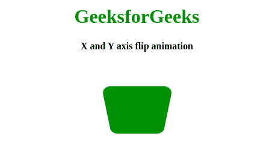
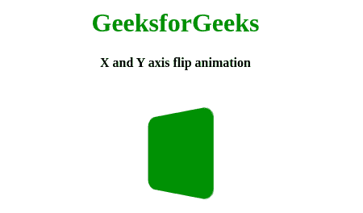

# 如何使用 HTML 和 CSS 创建 X、Y 轴翻转动画？

> 原文:[https://www . geesforgeks . org/如何创建-x 轴和 y 轴-翻转-动画-使用-html 和-css/](https://www.geeksforgeeks.org/how-to-create-x-and-y-axis-flip-animation-using-html-and-css/)



翻转动画是一种加载动画，其中我们使用方形翻转效果来赋予加载动画的感觉。当网站内容加载时间过长时，这类动画非常有用。这个动画可以吸引访问者，防止他们在没有看到内容的情况下离开您的网页。这个动画工作背后的主要概念是[变换](https://www.geeksforgeeks.org/css-transform-property/)和[@关键帧](https://www.geeksforgeeks.org/css-keyframes-rule/)的应用。请在尝试执行此代码之前仔细阅读它们。

**HTML 代码::**创建一个 HTML 文件，并在其中创建一个 div。

```html
<!DOCTYPE html>
<html lang="en">

<head>
    <meta charset="UTF-8" />
    <meta name="viewport" 
          content="width=device-width, initial-scale=1.0" />
    <title>X and Y axis flip animation</title>
</head>

<body>
    <center>
        <h1>GeeksforGeeks</h1>
        <b> X and Y axis flip animation</b>
        <div class="geeks"></div>
    </center>
</body>

</html>
```

**CSS 代码:**在 CSS 中，我们做的第一件事就是给身体提供一个背景。将背景应用于 div 和一些边框半径，以获得圆角。应用标识符为**的线性动画制作**动画。使用关键帧，我们将动画应用于我们的标识符。我们在前半帧沿着 X 轴旋转，在静止时沿着 Y 轴旋转。这不是必需的，但是您可以更改旋转角度以获得不同类型的翻转效果。这个是基本的翻转效果。

```html
<style>
    body {
        margin: 0;
        padding: 0;
    }

    h1 {
        color: green;
    }

    .geeks {
        position: absolute;
        top: 45%;
        left: 50%;
        transform: translate(-50%, -50%);
        width: 100px;
        height: 100px;
        background: green;
        border-radius: 13px;
        animation: animate 2s linear infinite;
    }

    @keyframes animate {
        0% {
            transform: translate(-50%, -50%) 
                       perspective(200px) 
                       rotateX(0deg) 
                       rotateY(0deg);
        }

        50% {
            transform: translate(-50%, -50%) 
                       perspective(200px) 
                       rotateX(-180deg) 
                       rotateY(0deg);
        }

        100% {
            transform: translate(-50%, -50%) 
                       perspective(200px) 
                       rotateX(-180deg) 
                       rotateY(-180deg);
        }
    }
</style>
```

**最终解决方案:**是 HTML 和 CSS 代码的组合。

```html
<!DOCTYPE html>
<html lang="en">

<head>
    <meta charset="UTF-8" />
    <meta name="viewport" 
          content="width=device-width, initial-scale=1.0" />
    <title>X and Y axis flip animation</title>
    <style>
        body {
            margin: 0;
            padding: 0;
        }

        h1 {
            color: green;
        }
        .geeks {
            position: absolute;
            top: 45%;
            left: 50%;
            transform: translate(-50%, -50%);
            width: 100px;
            height: 100px;
            background: green;
            border-radius: 13px;
            animation: animate 2s linear infinite;
        }

        @keyframes animate {
            0% {
                transform: translate(-50%, -50%) 
                  perspective(200px) 
                  rotateX(0deg) 
                  rotateY(0deg);
            }
            50% {
                transform: translate(-50%, -50%)
                  perspective(200px) 
                  rotateX(-180deg) 
                  rotateY(0deg);
            }
            100% {
                transform: translate(-50%, -50%)
                  perspective(200px) 
                  rotateX(-180deg)
                  rotateY(-180deg);
            }
        }
    </style>
</head>

<body>
    <center>
        <h1>GeeksforGeeks</h1>
        <b> X and Y axis flip animation</b>
        <div class="geeks"></div>
    </center>
</body>

</html>
```

**输出:**
