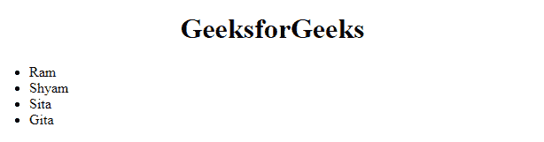

# 如何从 JavaScript 数组创建 HTML 列表？

> 原文:[https://www . geesforgeks . org/how-creating-html-list-from-JavaScript-array/](https://www.geeksforgeeks.org/how-to-creating-html-list-from-javascript-array/)

在本文中，我们将从一个 JavaScript 数组创建一个 HTML 列表。当我们从任何来源获取 JSON 并将数据显示到前端时，有时需要这样做，在许多其他情况下也是如此。

**问题陈述**:将数组 **['拉姆'，'希亚姆'，'西塔'，'吉塔']** 显示成一个 HTML 列表。

为此，我们将遵循以下步骤。

*   **第一步:**创建 HTML 骨架。

    ## 超文本标记语言

    ```html
    <!DOCTYPE html>
    <html>
      <head> </head>
      <body>
        <center><h1>GeeksforGeeks</h1></center>
        <ul id="myList"></ul>
      </body>
    </html>
    ```

*   **第二步:**创建一个名为*的变量列表*，获取 id 为“myList”的元素。

    ## java 描述语言

    ```html
    let list = document.getElementById("myList");
    ```

*   **步骤 3:** 现在使用 JavaScript[*forEach*](https://www.geeksforgeeks.org/javascript-array-foreach-method/)迭代所有数组项，在每次迭代时，创建一个 *li* 元素，并将 *innerText* 值与当前项相同，并将 *li* 追加到列表中。

    ## java 描述语言

    ```html
    let data = ['Ram', 'Shyam', 'Sita', 'Gita' ];

    let list = document.getElementById("myList");

    data.forEach((item)=>{
      let li = document.createElement("li");
      li.innerText = item;
      list.appendChild(li);
    })
    ```

**完整代码:**

## 超文本标记语言

```html
<!DOCTYPE html>
<html>
  <head> </head>
  <body>
    <center><h1>GeeksforGeeks</h1></center>
    <ul id="myList"></ul>
    <script>
      let data = ["Ram", "Shyam", "Sita", "Gita"];

      let list = document.getElementById("myList");

      data.forEach((item) => {
        let li = document.createElement("li");
        li.innerText = item;
        list.appendChild(li);
      });
    </script>
  </body>
</html>
```

**输出:**

