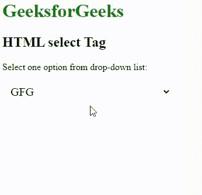
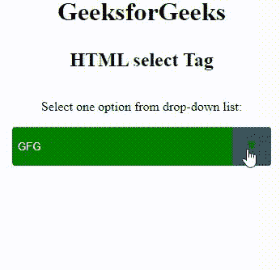
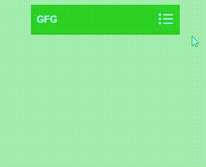

# 如何用 CSS3 自定义一个“选择”的 HTML 表单元素？

> 原文:[https://www . geesforgeks . org/how-customize-a-select-html-form-element-with-css3/](https://www.geeksforgeeks.org/how-to-customize-a-select-html-form-element-with-css3/)

使用 HTML 中的 [**<选择>**](https://www.geeksforgeeks.org/html-select-tag/) 标签创建下拉列表。 [*<选择>*](https://www.geeksforgeeks.org/html-select-tag/) 标签包含 [*<选项>*](https://www.geeksforgeeks.org/html-option-tag/) 标签以显示可用选项的下拉列表。在本文中，您将学习到许多用 CSS 3 自定义***选择* HTML 表单元素的方法。**

****注意:**表单中使用 *<选择>* 标签接收用户响应。**

****语法:****

```html
<select>
    <option>
    <option>
    ...
<select>
```

****例 1:****

## **超文本标记语言**

```html
<!DOCTYPE html>
<html>
<head>
    <title>
        HTML select Tag
    </title>
    <style>
     *,
      *::before,
      *::after {
        box-sizing: border-box;
      }

     h1 
      {
         color:green;
       }
     select
     {
     // Removing the default dropdown arrow
      appearance: none;
      background-color: transparent;
      border: none;
      padding: 0 1em 0 0;
      margin: 0;
      width: 100%;
      font-family: inherit;
      font-size: inherit;
      cursor: inherit;
      line-height: inherit;
      z-index: 1;
      // Remove focus outline
      outline: none;
     }

    .select {
     display: grid;
     grid-template-areas:"select";
     align-items: center;
     position: relative; 

     min-width: 15ch;
     max-width: 30ch;

     border: 1px solid var(#777);
     border-radius: 0.25em;
     padding: 0.25em 0.5em;

    font-size: 1.25rem;
    cursor: pointer;
    line-height: 1.1; 
   }

  /* Hide arrow icon in IE browsers */
  .select::-ms-expand
  {
    display: none;
  }
  .select:hover::after 
   {
    border-color: #888;
   }

// Focus on selected item
.select:focus
   {
    border-color:     #800080;
    box-shadow: 0 0 1px 3px rgba(59, 153, 252, .7);
    color: #222; 
    outline: none;
   }
.slct:after 
   {
    content: '';
    display: inline-block;
    float: right;
    width: .5rem;
    height: .5rem;
    border-bottom: 1px solid currentColor;
    border-left: 1px solid currentColor;
    border-bottom-left-radius: 2px;
    transform: rotate(45deg) translate(50%, 0%);
    transform-origin: center center;
    transition: transform ease-in-out 100ms
  }

   <!-- For different browsers -->
     .select::after 
      {
           -webkit-transition: .25s all ease;
            -o-transition: .25s all ease;
            transition: .25s all ease;
      }

  </style>
</head>

<body>
    <h1>GeeksforGeeks</h1>

    <h2>HTML select Tag</h2>
    <p>Select one option from drop-down list:</p>
    <div class="select">
      <select class="slct">
        <option value="GFG">GFG</option>
        <option value="OS">OS
        </option>
        <option value="DBMS">DBMS</option>

        <option value="Data Structure">
            Data Structure
        </option>
      </select>      
   </div>
</body>

</html>
```

****输出:****

****

****例 2:****

## **超文本标记语言**

```html
<!DOCTYPE html>
<html>

<head>
    <title>
        HTML select Tag
    </title>
    <style>
     body {
      display: flex;
      flex-direction: column;
      justify-content: center;
      align-items: center;
      height: 100vh;  
     }
    h1 {
     margin: 0 0 0.25em;
    }
    /* Reset Select */
    select {
     -webkit-appearance: none;
      -moz-appearance: none;
      -ms-appearance: none;
      appearance: none;
      outline: 0;
      box-shadow: none;
      border: 0 !important;
      background: green;
      background-image: none;
    }
    /* Remove IE arrow */
    select::-ms-expand {
      display: none;
    }
    /* Custom Select */
    .select {
      position: relative;
      display: flex;
      width: 20em;
      height: 3em;
      line-height: 3;
      background: #2c3e50;
      overflow: hidden;
      border-radius: .25em;
    }
    select {
      flex: 1;
      padding: 0 .5em;
      color: #fff;
      cursor: pointer;
    }
    /* Arrow */
    .select::after {
      content: '\25BC';
      position: absolute;
      top: 0;
      right: 0;
      padding: 0 1em;
      background: #34495e;
      cursor: pointer;
      pointer-events: none;
      -webkit-transition: .25s all ease;
      -o-transition: .25s all ease;
      transition: .25s all ease;
    }
    /* Transition */
    .select:hover::after {
      color: green;
    }

  </style>
</head>

<body>
    <h1>GeeksforGeeks</h1>

    <h2>HTML select Tag</h2>
    <p>Select one option from drop-down list:</p>
    <div class="select">
     <select class="slct">
        <option value="GFG">GFG</option>
        <option value="OS">OS
        </option>
        <option value="DBMS">DBMS</option>

        <option value="Data Structure">
            Data Structure
        </option>
     </select>      
    </div>
</body>
</html>                    
```

****输出:****

****

****例 3:****

## **超文本标记语言**

```html
<!DOCTYPE html>
<html lang="en">
<head>
  <meta charset="UTF-8">
  <meta name="viewport" content="width=device-width, initial-scale=1.0">
  <title>Pure CSS Styled Select</title>
  <style>
    body {
      background-color: #a4ecae;
      font-family: 'Source Sans Pro', sans-serif;

    }
    .demo {
      margin: 100px auto;
    }

    .dropdown-container {
      width: 250px;
      margin: 100px auto;
      position: relative;
    }

    select {
      width: 100%;
      height: 50px;
      font-size: 100%;
      font-weight: bold;
      cursor: pointer;
      border-radius: 0;
      background-color: #2bd325;
      border: none;
      border-bottom: 2px solid #37c40c;
      color: white;
      appearance: none;
      padding: 10px;
      padding-right: 38px;
      -webkit-appearance: none;
      -moz-appearance: none;
      transition: color 0.3s ease, background-color 0.3s ease,
                   border-bottom-color 0.3s ease;
    }

    /* For IE <= 11 */
    select::-ms-expand {
      display: none; 
    }

    .select-icon {
      position: absolute;
      top: 4px;
      right: 4px;
      width: 30px;
      height: 36px;
      pointer-events: none;
      border: 2px solid #70d82a;
      padding-left: 5px;
      transition: background-color 0.3s ease, border-color 0.3s ease;
    }
    .select-icon svg.icon {
      transition: fill 0.3s ease;
      fill: white;
    }
    <!--- hover and focus effect-->
    select:hover,
    select:focus {
      color: #5ac02b;
      background-color: white;
      border-bottom-color: #141313;
    }
    <!---- CSS selector -->
    select:hover ~ .select-icon,
    select:focus ~ .select-icon {
      background-color: white;
      border-color: #3dd13db6;
    }
    select:hover ~ .select-icon svg.icon,
    select:focus ~ .select-icon svg.icon {
      fill: #67c02b;
    }

  </style>
</head>
<body>
  <div class="demo">
    <div class="dropdown-container">
      <select class="slct">
        <option value="1">GFG</option>
        <option value="2">OS
          </option>
        <option value="3">DBMS</option>

        <option value="4">
          Data Structure
        </option>
        </select>
      <!-----Adding a custom icon on the right-->
      <div class="select-icon">
        <svg focusable="false" viewBox="0 0 104 128" 
             width="25" height="35" class="icon">
          <path 
               d="m2e1 95a9 9 0 0 1 -9 9 9 9 0 0 1 -9 -9 9 9
                  0 0 1 9 -9 9 9 0 0 1 9 9zm0-3e1a9 9 0 0 1 
                  -9 9 9 9 0 0 1 -9 -9 9 9 0 0 1 9 -9 9 9 0 0 
                  1 9 9zm0-3e1a9 9 0 0 1 -9 9 9 9 0 0 1 -9 -9 9 
                  9 0 0 1 9 -9 9 9 0 0 1 9 9zm14 
                  55h68v1e1h-68zm0-3e1h68v1e1h-68zm0-3e1h68v1e1h-68z">
          </path>
        </svg>
      </div>
    </div>
  </div>
</body>
```

****输出:****

****