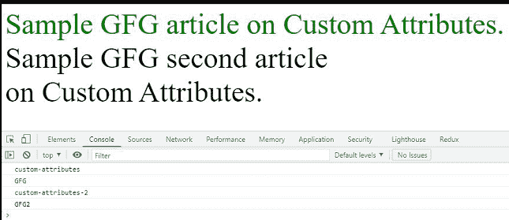

# 如何在 HTML 中声明自定义属性？

> 原文:[https://www . geesforgeks . org/如何在 html 中声明自定义属性/](https://www.geeksforgeeks.org/how-to-declare-a-custom-attribute-in-html/)

[属性](https://www.geeksforgeeks.org/html-attributes/)是为 HTML 元素提供的额外信息。HTML 中有很多预定义的属性。

当预定义属性对于存储额外数据没有意义时，自定义属性允许用户创建自定义数据。如果想在 HTML 中定义自己的自定义属性，可以通过**数据-*** 格式实现。*可以替换为您的任何名称，以指定元素的特定数据，并以 CSS、JavaScript 或 jQuery 为目标。在定义自定义属性之前，需要记住一些规则。

*   您必须用小写字母定义您的属性。即使某些浏览器确实会自动纠正标记中的错误，但它也会导致错误，并且它们不是有效的 HTML5。
*   它不能以 XML 开头(不区分大小写)
*   它不应包含任何冒号字符(:)。

通过 [HTML 数据-*属性](https://www.geeksforgeeks.org/html-data-attributes/)，任何普通的 HTML 元素都可能变得相当复杂和自定义。让我们用 HTML 为这篇文章定义一个简单的文章标签，并存储一些额外的信息。您可以在 JavaScript 和 CSS 中访问这些值，并根据您的目的使用它们。您甚至可以定义类似于预定义标签的名称。自定义属性数据标识不同于通常使用的*标识*标签。您可以控制这些值并进行测试。

**示例:**

## 超文本标记语言

```html
<!DOCTYPE html>
<html>

<head>
    <style>
        body {
            background-color: "red";
        }

        article[data-parent="GFG"] {
            width: 1000px;
            font-size: 50px;
            color: green;
        }

        article[data-parent="GFG2"] {
            width: 600px;
            color: black;
            font-size: 50px;
        }
    </style>
</head>

<body>
    <article id="1" 
        data-title="custom-attributes" 
        data-parent="GFG">
        Sample GFG article on Custom Attributes.
    </article>

    <article id="2" 
        data-title="custom-attributes-2" 
        data-parent="GFG2">
        Sample GFG second article 
        on Custom Attributes.
    </article>

    <script>
        const article = document.getElementById('1');
        const article2 = document.getElementById('2');

        // "custom-attributes"
        console.log(article.dataset.title);

        // "GFG"
        console.log(article.dataset.parent);

        // "custom-attributes-2"
        console.log(article2.dataset.title);

        // "GFG2"
        console.log(article2.dataset.parent);
    </script>
</body>

</html>
```

**输出:**



自定义属性