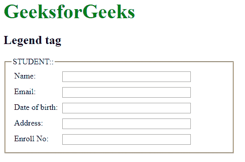

# 如何在 HTML5 中为 fieldset 元素定义标题？

> 原文:[https://www . geeksforgeeks . org/如何为 html5 中的字段集元素定义标题/](https://www.geeksforgeeks.org/how-to-define-a-caption-for-a-fieldset-element-in-html5/)

在本文中，我们通过使用 **[图例](https://www.geeksforgeeks.org/html-legend-tag/)** 元素来定义字段集元素的标题。它用于定义子内容的标题。图例元素是父元素。

**语法:**

```html
<legend> Content... </legend>
```

**示例:**

```html
<!DOCTYPE html>
<html>

<head>
    <title>Legend Tag</title>
    <style>
        form {
            width: 50%;
        }

        label {
            display: inline-block;
            float: left;
            clear: left;
            width: 90px;
            margin: 5px;
            text-align: left;
        }

        input[type="text"] {
            width: 250px;
            margin: 5px 0px;
        }

        .gfg {
            font-size: 40px;
            color: green;
            font-weight: bold;
        }
    </style>
</head>

<body>
    <div class="gfg">
        GeeksforGeeks
    </div>

    <h2>Legend tag</h2>

    <form>
        <fieldset>
            <legend>STUDENT::</legend>
            <label>Name:</label>
            <input type="text">
            <br>

            <label>Email:</label>
            <input type="text">
            <br>

            <label>Date of birth:</label>
            <input type="text">
            <br>

            <label>Address:</label>
            <input type="text">
            <br>

            <label>Enroll No:</label>
            <input type="text">
        </fieldset>
    </form>
</body>

</html>
```

**输出:**


**支持的浏览器:**

*   谷歌 Chrome
*   微软公司出品的 web 浏览器
*   火狐浏览器
*   歌剧
*   旅行队