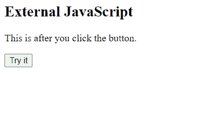

# 如何在 HTML5 中定义客户端脚本？

> 原文:[https://www . geesforgeks . org/如何定义客户端脚本 html5/](https://www.geeksforgeeks.org/how-to-define-a-client-side-script-in-html5/)

要在 HTML5 中定义客户端脚本，我们可以通过向 HTML 文件添加 **src** 属性来进行

**语法:**

```html
<script>
   // JavaScript goes here
   console.log('GeeksforGeeks');
</script>
```

以下是上述方法的示例:

**例 1:** 这里脚本是使用<脚本>标签添加的。

## 超文本标记语言

```html
<!DOCTYPE html>
<html>
<body>
    <h1>Welcome To GFG</h1>
    <p id="id1">
      Default code has been loaded into the Editor.
    </p>
    <script>
        document.getElementById("id1").innerHTML=
        "Welcome to GeeksForGeeks"
    </script>
</body>
</html>
```

**输出:**


**示例 2:** 这里，外部 JavaScript 用于脚本编写。

## index.html

```html
<!DOCTYPE html>
<html>
<body>
    <h2>External JavaScript</h2>
    <p id="id1">
      This is before you click the button
    </p>

    <button type="button" onclick="clickMe()">
        Click Me
    </button>

    <script src="main.js"></script>

</body>
</html>
```

## main.js

```html
function clickMe() {
     document.getElementById("id1").innerHTML = 
     "This is after you click the button";
}
```

**输出:**

 