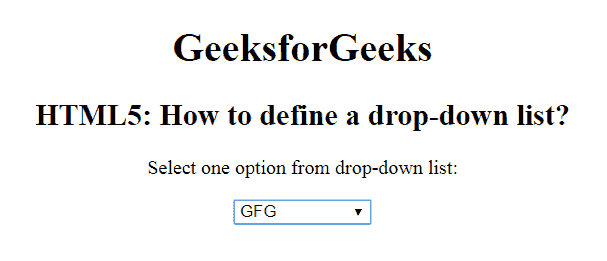

# 如何在 HTML5 中定义下拉列表？

> 原文:[https://www . geesforgeks . org/如何定义下拉列表 html5/](https://www.geeksforgeeks.org/how-to-define-a-drop-down-list-in-html5/)

在本文中，我们通过使用 **<选择文档中的>** 元素来定义一个下拉列表。该标签用于创建下拉列表。 **<选择>** 标签包含 **<选项>** 标签以显示下拉列表的可用选项。
**注:**标签以表格形式使用，接收用户响应。
**语法:**

```html
<select>
    <option>
    <option>
    ...
<select>

```

**例:**

## 超文本标记语言

```html
<!DOCTYPE html> 
<html> 

<head> 
    <title> 
        HTML5: How to define a drop-down list?

    </title> 
</head> 

<body style="text-align:center;"> 
    <h1>GeeksforGeeks</h1> 

    <h2>HTML5: How to define a drop-down list?
</h2> 

<p>Select one option from drop-down list:</p>

    <select> 
        <option value="GFG">GFG</option> 
        <option value="OS">OS</option> 
        <option value="DBMS">DBMS</option> 
        <option value="Data Structure"> 
            Data Structure 
        </option> 
    </select> 
</body> 

</html>                     
```

**输出:**



**支持的浏览器如下:**

*   谷歌 Chrome
*   微软公司出品的 web 浏览器
*   火狐浏览器
*   歌剧
*   旅行队