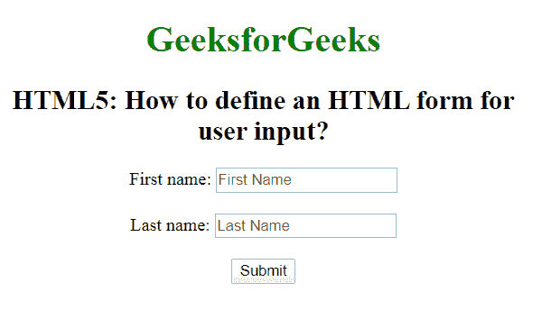

# 如何使用 HTML5 定义用户输入的表单？

> 原文:[https://www . geesforgeks . org/如何使用 html5 定义用户输入表单/](https://www.geeksforgeeks.org/how-to-define-a-form-for-user-input-using-html5/)

在本文中，我们将学习如何使用 **[<表单>标签](https://www.geeksforgeeks.org/html-form-tag/)** 在网页中创建表单。该标签用于创建用户输入表单。还有许多元素在**表格**标签中使用。

**语法:**

```html
<form> Form Content... </form>
```

**示例:**下面的代码片段演示了表单的简单创建。

```html
<!DOCTYPE html>
<html>

<head>
    <title>
        HTML5: How to define an 
        HTML form for user input?
    </title>

    <style>
        body {
            text-align: center;
        }

        h1 {
            color: green;
        }
    </style>
</head>

<body>
    <h1>GeeksforGeeks</h1>

    <h2>
        HTML5: How to define an 
        HTML form for user input?
    </h2>

    <form action="#">
        First name:
        <input type="text" 
            placeholder="First Name" value="">
        <br><br>

        Last name:
        <input type="text" 
            placeholder="Last Name" value="">
        <br><br>

        <input type="submit" value="Submit">
    </form>
</body>

</html>                
```

**输出:**


**支持的浏览器:**

*   谷歌 Chrome
*   微软公司出品的 web 浏览器
*   火狐浏览器
*   歌剧
*   旅行队