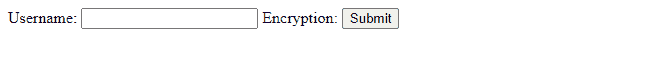
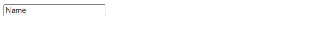

# 如何在 HTML5 中定义密钥对生成器字段？

> 原文:[https://www . geeksforgeeks . org/如何定义密钥对生成器字段 html5/](https://www.geeksforgeeks.org/how-to-define-a-key-pair-generator-field-in-html5/)

HTML[***<key gen>***](https://www.geeksforgeeks.org/html-keygen-tag/)元素可以帮助生成作为 HTML 表单一部分的密钥材料并提交公钥。该机制旨在用于基于 web 的证书系统。 *< keygen >* 元素预计将与构建证书请求所需的附加信息一起以 HTML 形式使用，签名证书将是该过程的结果。

**语法:**的语法 *< keygen >* 的标记是

```html
<keygen name="name">
```

**例 1:**

## 超文本标记语言

```html
<!DOCTYPE html>
<html>
<head>
<title>GFG</title>
</head>
<body>
    <form action="/gfg" method="post">
        <label>Username: <input type="text" name="uname"></label>
        <label>Encryption: <keygen name="lock"></label>
        <input type="submit" value="Submit">
    </form>
</body>
</html>
```

**输出:**



基根

**例 2:**

## 超文本标记语言

```html
<!DOCTYPE html>
<html>
   <head>
      <title>GFG</title>
   </head>
   <body>
      <form>
         <keygen name = "key" challenge = "000">
         <input name = "name" value = "Name">
      </form>
   </body>
</html>
```

**输出:**



keygen 挑战赛