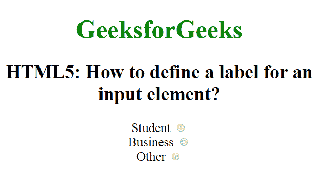

# 如何用 HTML5 定义输入元素的标签？

> 原文:[https://www . geesforgeks . org/如何使用 html5 为输入元素定义标签/](https://www.geeksforgeeks.org/how-to-define-a-label-for-an-input-element-using-html5/)

在本文中，我们将学习如何使用 **[<标签>标签](https://www.geeksforgeeks.org/html-label-tag/)** 为输入元素定义标签。它用于为鼠标用户提供可用性改进，即如果用户单击标签元素中的文本，它将切换控件。标签标签定义了按钮或文本区域元素的标签。

**语法:**

```html
<label> form content... </label>
```

**示例:**

```html
<!DOCTYPE html>
<html>

<head>
    <title>
        Define a label for 
        an input element
    </title>

    <style>
        body {
            font-size: 20px;
        }
    </style>
</head>

<body style="text-align:center">

    <h1 style="color:green">
        GeeksforGeeks
    </h1>

    <h2>
        HTML5: How to define a label 
        for an input element?
    </h2>

    <form>

        <!-- Starts label tag from here -->
        <label for="student">
            Student
        </label>

        <input type="radio" name="Occupation" 
            id="student" value="student"><br>

        <label for="business">
            Business
        </label>

        <input type="radio" name="Occupation" 
            id="business" value="business"><br>

        <label for="other">
            Other
        </label>
        <!-- Ends label tags here -->

        <input type="radio" name="Occupation"
            id="other" value="other">
    </form>
</body>

</html>
```

**输出:**


**支持的浏览器:**

*   谷歌 Chrome
*   微软公司出品的 web 浏览器
*   火狐浏览器
*   歌剧
*   旅行队