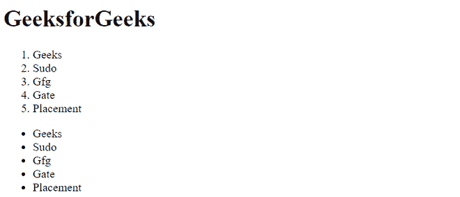

# 如何在 HTML5 中定义列表项？

> 原文:[https://www . geeksforgeeks . org/如何定义列表项目 html5/](https://www.geeksforgeeks.org/how-to-define-a-list-item-in-html5/)

要在 HTML5 中定义一个列表，我们可以使用 [HTML < li >标签](https://www.geeksforgeeks.org/html-li-tag/)。但是 HTML 中有两种类型的列表。一个是有序列表，另一个是无序列表。对于已订购的我们可以使用 [HTML < ol >标签](https://www.geeksforgeeks.org/html-ol-tag/)，对于未订购的列表，我们将使用 [HTML < ul >标签](https://www.geeksforgeeks.org/html-ul-tag/)。

另外，我们可以更改列表类型，为此，您可以查看下面的文章。

*   [HTML < li >类型属性](https://www.geeksforgeeks.org/html-li-type-attribute/)
*   [HTML < ol >类型属性](https://www.geeksforgeeks.org/html-ol-type-attribute/)
*   [HTML < ul >类型属性](https://www.geeksforgeeks.org/html-ul-type-attribute/)

**有序列表:**它定义了一个项目列表，其中项目的顺序很重要。有序列表也称为数字列表。清单项目包含在< ol >和< /ol >标签中。排序由编号方案给出，使用阿拉伯数字、字母或罗马数字。

**语法:**

```html
<ol>
      <li>List item 1</li>
      <li>List item 2</li>
</ol>
```

**无序列表:**用于排序不具体的项目。无序列表也称为项目符号列表。使用< ul >和< ul/ >标签定义列表。列表中的每次都是使用< li >标签定义的。

**语法:**

```html
<ul>
      <li>List item 1</li>
      <li>List item 2</li>
</ul>
```

**示例:**下面的代码演示了有序列表和无序列表。

## 超文本标记语言

```html
<!DOCTYPE html>
<html>

<body>
    <h1>GeeksforGeeks</h1>
    <ol>
        <li>Geeks</li>
        <li>Sudo</li>
        <li>Gfg</li>
        <li>Gate</li>
        <li>Placement</li>
    </ol>
    <ul>
        <li>Geeks</li>
        <li>Sudo</li>
        <li>Gfg</li>
        <li>Gate</li>
        <li>Placement</li>
    </ul>
</body>

</html>
```

**输出:**



有序列表和无序列表