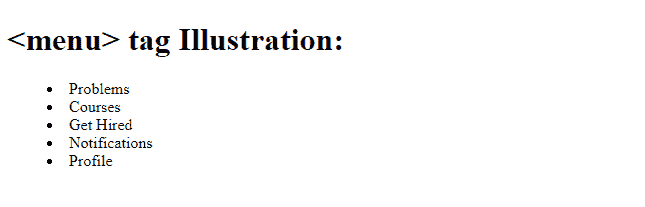
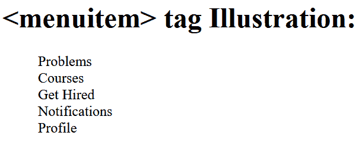

# 如何在 HTML5 中定义命令列表或菜单？

> 原文:[https://www . geesforgeks . org/如何定义 html5 中的命令列表或菜单/](https://www.geeksforgeeks.org/how-to-define-a-list-or-menu-of-commands-in-html5/)

[<菜单>](https://www.w3docs.com/learn-html/html-menu-tag.html) 标签用于定义 HTML5 中的命令列表或菜单。它可以包含一个以上的 [< li >](https://www.geeksforgeeks.org/html-li-tag/) 或 [< menuitem >](https://www.geeksforgeeks.org/html-menuitem-tag/#:~:text=Related%20Articles&text=The%20HTML%20tag%20is,is%20not%20supported%20in%20HTML5.) 元素。

<menu>标签只有最新的 Mozilla firefox 网络浏览器才支持。这个标签也支持 HTML5 中的[事件](https://www.geeksforgeeks.org/html-event-attributes-complete-reference/)属性。</menu>

**语法:**

**示例:**以下示例演示了 *<菜单>* 标签与 *< li >* 标签一起定义列表的类型。

## 超文本标记语言

```html
<!DOCTYPE html>
<html>
  <body>
    <h1><menu> tag Illustration:</h1>
    <menu>
      <li>Problems</li>
      <li>Courses</li>
      <li>Get Hired</li>
      <li>Notifications</li>
      <li>Profile</li>
    </menu>
  </body>
</html>
```

**输出:**



标记菜单

**注意:**使用 Mozilla Firefox 网络浏览器进行输出。

**示例 2:** 以下示例演示了使用带有 *<菜单项>* 标签的 *<菜单>* 来显示项目。

最新版本的 HTML 即 HTML5 不支持标签。建议使用以前的版本进行输出。

**语法:**

```html
<menu>
   <menuitem> </menuitem>
</menu>
```

## 超文本标记语言

```html
<!DOCTYPE html>
<html>
  <body>
    <h1><menuitem> tag Illustration:</h1>
    <menu>
      <menuitem>Problems</menuitem>
      <menuitem>Courses</menuitem>
      <menuitem>Get Hired</menuitem>
      <menuitem>Notifications</menuitem>
      <menuitem>Profile</menuitem>
    </menu>
  </body>
</html>
```

**输出:**



menu item-功能表项目

**注意:**使用 Mozilla Firefox 网络浏览器进行输出。