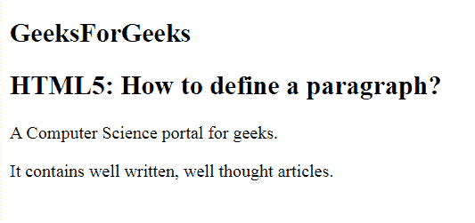

# 如何在 HTML5 中定义一个段落？

> 原文:[https://www . geesforgeks . org/如何定义 html5 中的段落/](https://www.geeksforgeeks.org/how-to-define-a-paragraph-in-html5/)

在本文中，我们使用文档中的一个 **[< p >元素](https://www.geeksforgeeks.org/html-paragraph/)** 来定义一个段落。HTML 中的 **< p >** 标签定义了段落。这些都有开始和结束标签。所以任何写在**<p>**</p>内的内容都被视为段落内容。大多数浏览器将一行作为段落阅读，即使我们没有使用结束标记，即< /p >，但这可能会产生意想不到的结果。所以，这是一个很好的约定，我们必须使用结束标记。

**语法:**

```html
<p> Content... </p>
```

**例 1:**

```html
<!DOCTYPE html>
<html>

<head>
    <title>
        HTML5: How to define
        a paragraph?
    </title>
</head>

<body>
    <h2>
        GeeksForGeeks
    </h2>
    <h2>
        HTML5: How to define 
        a paragraph?
    </h2>
    <p>
        A Computer Science 
        portal for geeks.
    </p>

    <p>
        It contains well written, 
        well thought articles.
    </p>
</body>

</html> 
```

**输出:**


**例 2:**

```html
<!DOCTYPE html>
<html>

<head>
    <title>
        HTML5: How to define a paragraph?
    </title>
</head>

<body>
    <h2>
        GeeksForGeeks
    </h2>
    <h2>
        HTML5: How to define a paragraph?
    </h2>
    <p>
        This paragraph has multiple
        lines. But HTML reduces them
        to a single line, omitting
        the carriage return we have used.
    </p>

    <p>
        This paragraph has multiple
        spaces. But HTML reduces them
        all to a single space, omitting
        the extra spaces and line 
        we have used.
    </p>
</body>

</html>
```

**输出:**


**支持的浏览器:**

*   谷歌 Chrome
*   微软公司出品的 web 浏览器
*   火狐浏览器
*   歌剧
*   旅行队