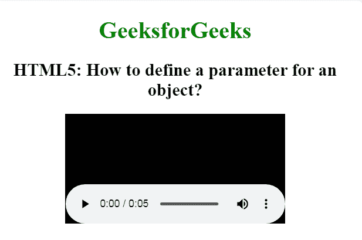

# 如何用 HTML 为一个对象定义一个参数？

> 原文:[https://www . geesforgeks . org/如何使用 html 为对象定义参数/](https://www.geeksforgeeks.org/how-to-define-a-parameter-for-an-object-using-html/)

在本文中，我们通过使用文档中的 [<参数>标记](https://www.geeksforgeeks.org/html-param-tag/)来定义对象的参数。在 HTML 中，< param >标签用于定义与元素关联的插件的参数。它不包含结束标记。

**语法:**

```html
<param name="" value="">
```

**示例:**以下示例演示了对象的“param”元素。

## 超文本标记语言

```html
<!DOCTYPE html>
<html>

<head>
    <title>
        How to define a parameter
        for an object using HTML?
    </title>

    <style>
        body {
            text-align: center;
        }

        h1 {
            color: green;
        }
    </style>
</head>

<body>
    <h1>GeeksforGeeks</h1>

    <h2>
        HTML5: How to define a
        parameter for an object?
    </h2>

    <object data="video.mp4">
        <param name="autoplay" 
            value="true">
    </object>
</body>

</html>                       
```

**输出:**


**支持的浏览器:**

*   谷歌 Chrome
*   微软公司出品的 web 浏览器
*   火狐浏览器
*   歌剧
*   旅行队