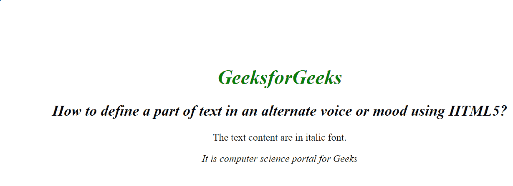

# 如何用 HTML5 以交替的语音或语气定义一部分文字？

> 原文:[https://www . geeksforgeeks . org/如何使用 html5 定义替代语音或情绪文本的一部分/](https://www.geeksforgeeks.org/how-to-define-a-part-of-text-in-an-alternate-voice-or-mood-using-html5/)

在本文中，我们通过在 HTML 文档中使用 **< i >** 标签，以交替的声音或语气定义文本的一部分。它用于以斜体显示内容。通常，它用于显示一些不同语言或技术的专业术语、短语或重要词汇。

**语法:**

```html
<i> Contents... </i>
```

**示例:**

```html
<!DOCTYPE html>
<html>

<head>
    <title>
        How to define a part of text
        in an alternate voice or mood 
        using HTML5?
    </title>

    <style>
        body {
            text-align: center;
        }

        h1 {
            color: green;
        }
    </style>
</head>

<body>
    <i>
        <h1>GeeksforGeeks</h1>
    </i>
    <h2>
        <i>
            How to define a part of 
            text in an alternate voice 
            or mood using HTML5?
        </i>
    </h2>

    <p>
        The text content are 
        in italic font.
    </p>

    <i>
        It is computer science 
        portal for Geeks
    </i>
</body>

</html>                  
```

**输出:**


**支持的浏览器如下:**

*   谷歌 Chrome
*   微软公司出品的 web 浏览器
*   火狐浏览器
*   歌剧
*   旅行队