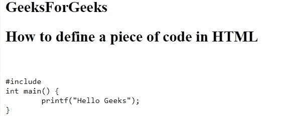
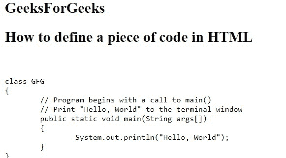

# 如何在 HTML5 中定义一段计算机代码？

> 原文:[https://www . geesforgeks . org/如何定义一段 html5 中的计算机代码/](https://www.geeksforgeeks.org/how-to-define-a-piece-of-computer-code-in-html5/)

在本文中，我们通过使用**代码**元素来定义一段代码。它用于定义计算机代码。在创建网页的过程中，有时需要显示计算机编程代码。它可以通过 HTML 的任何基本标题标签来完成，但是 HTML 提供了一个单独的标签，即<代码>。
代码标签是一种代表计算机输出的特定类型的文本。HTML 提供了许多文本格式化的方法，但是<代码>标签是以固定的字母大小、字体和间距显示的。

**语法:**

```html
<code> Contents... </code>
```

**例 1:**

**示例:**

```html
<html>
    <head>
        <title>
            How to define a piece of code in HTML
        </title>
    </head>
    <body>
        <h2>GeeksForGeeks</h2>
        <h2>How to define a piece of code in HTML</h2>
<pre> 
<code> 
#include<stdio.h> 
int main() { 
    printf("Hello Geeks"); 
} 
</code> 
</pre> 

    </body>
</html>
```

**输出:**


**例 2:**

```html
<html>
    <head>
        <title>
            How to define a piece of code in HTML
        </title>
    </head>
    <body>
        <h2>GeeksForGeeks</h2>
        <h2>How to define a piece of code in HTML</h2>
<pre> 
<code> 
class GFG 
{ 
    // Program begins with a call to main() 
    // Print "Hello, World" to the terminal window 
    public static void main(String args[]) 
    { 
        System.out.println("Hello, World"); 
    } 
} 
</code> 
</pre>
    </body>
</html>
```

**输出:**


**支持的浏览器如下:**

*   谷歌 Chrome
*   微软公司出品的 web 浏览器
*   火狐浏览器
*   歌剧
*   旅行队