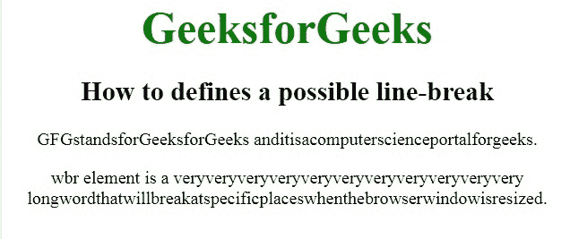
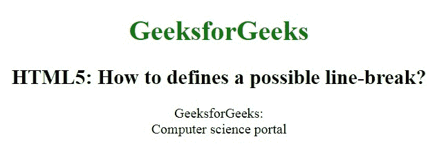

# 如何用 HTML5 定义可能的换行？

> 原文:[https://www . geesforgeks . org/如何使用-html5/](https://www.geeksforgeeks.org/how-to-define-a-possible-line-break-using-html5/) 定义可能的换行

在本文中，我们通过使用 **[< wbr >元素](https://www.geeksforgeeks.org/html-5-wbr-tag/)** 来定义 HTML 中可能的换行符。它代表断字机会，用于定义文本中被浏览器视为换行符的位置。当使用的单词太长，浏览器可能会在不适合文本的地方换行时，通常会用到它。

**语法:**

```html
<wbr>
    // Contents
</wbr>
```

**例 1:**

```html
<!DOCTYPE html>
<html>

<head>
    <title>
        How to defines a possible 
        line-break using HTML5?
    </title>

    <style>
        body {
            text-align: center;
        }

        .gfg {
            font-size: 40px;
            font-weight: bold;
            color: green;
        }

        .geeks {
            font-size: 25px;
            font-weight: bold;
        }
    </style>
</head>

<body>
    <div class="gfg">
        GeeksforGeeks
    </div>

    <h2>
        How to defines a
        possible line-break
    </h2>

    <p>
        GFGstandsforGeeksforGeeksanditis<wbr>
        acomputerscienceportalforgeeks.
    </p>
    <p>
        wbr element is a veryveryveryveryveryveryveryveryveryveryvery
        <wbr>longwordthatwillbreakatspecific<wbr>
        placeswhenthebrowserwindowisresized.
    </p>
    <b>By using the css Property
</body>

</html>       
```

**输出:**


**例 2:**

```html
<!DOCTYPE html>
<html>

<head>
    <title>
        How to define a possible 
        line-break using HTML5?
    </title>

    <style>
        body {
            text-align: center;
        }

        h1 {
            color: green;
        }
    </style>
</head>

<body>
    <h1>GeeksforGeeks</h1>
    <h2>
        HTML5: How to defines 
        a possible line-break?
    </h2>

    <!-- br tag is used here -->
    <p>
        GeeksforGeeks: <br> 
        Computer science portal
    </p>
</body>

</html>
```

**输出:**


**支持的浏览器:**

*   谷歌 Chrome
*   微软公司出品的 web 浏览器
*   火狐浏览器
*   歌剧
*   旅行队