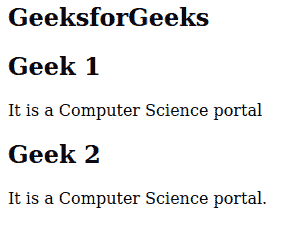

# 如何在 HTML5 中定义文档中的一个节？

> 原文:[https://www . geesforgeks . org/如何在 html5 中定义文档中的某个部分/](https://www.geeksforgeeks.org/how-to-define-a-section-in-a-document-in-html5/)

在本文中，我们将讨论如何在 html5 中定义文档中的节。

[**HTML <节>标签**](https://www.geeksforgeeks.org/html-section-tag/) **:** 节标签将内容分为节和小节。当需要两个页眉、页脚和文档的其他部分时，使用节标签。

**语法:**

```html
<section> content </section>
```

下面是说明使用*部分* 标签**的代码。**

**例 1:**

## 超文本标记语言

```html
<!DOCTYPE html>
<html>
<body>
  <section>
    <h1>GFG Section-1</h1>
  </section>

  <section>
    <h1>GFG Section-2</h1>

<p> HTML5 HTML5</p>

  </section>
  <section>
    <h1>GFG Section-3</h1>
  </section>

  <section>
    <h1>GFG Section-4</h1>

<p>HTML5 HTML5</p>

  </section>
</body>

</html>
```

**输出:**


**例 2:**

## 超文本标记语言

```html
<!DOCTYPE html>
<html>
<body>
  <h2>GeeksforGeeks</h2>
  <section>
    <h2>Geek 1</h2>

<p>
      It is a Computer Science portal
    </p>

  </section>

  <section>
    <h2>Geek 2</h2>

<p>
      It is a Computer Science portal.
    </p>

  </section>
</body>

</html>
```

**输出:**

