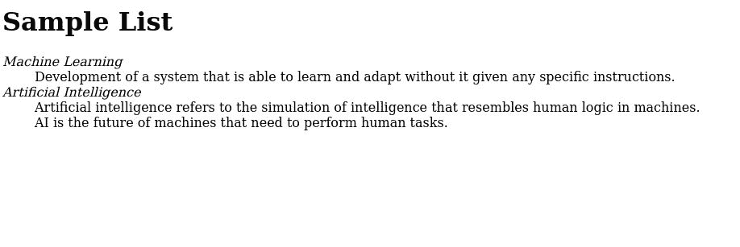

# 如何使用 HTML5 在定义列表中定义术语或名称？

> 原文:[https://www . geeksforgeeks . org/如何使用 html5 定义术语或定义列表中的名称/](https://www.geeksforgeeks.org/how-to-define-a-term-or-name-in-a-definition-list-using-html5/)

HTML5 提供了一种以格式化的方式指定与之相关联的术语和定义的方法。描述列表(或旧版本中的定义列表)提供了术语及其定义的系统安排。

以下标签用于定义定义列表:

*   **< DL > :** 这是定义列表。它将术语及其定义保存为表中的行和数据
*   **< DT > :** 这是定义术语。它包含要定义的术语。
*   **< DFN > :** 这是定义元素。它包含在内容中定义的术语。
*   **< DD > :** 这是定义或描述。它保存给定术语的定义。

以下示例说明了定义列表的创建。

**示例:**本示例创建了一个包含机器学习和人工智能这两个术语的定义列表，并给出了它们各自的定义。

## 超文本标记语言

```html
<html>
<body>
  <h1>Sample List</h1>
  <dl>
    <dt>
      <dfn>
        Machine Learning
      </dfn>
    </dt>
    <dd>Development of a system
      that is able to learn and adapt
      without it given any specific
      instructions.
    </dd>
    <dt>
      <dfn>
        Artificial Intelligence
      </dfn>
    </dt>
    <dd>Artificial intelligence refers
      to the simulation of intelligence
      that resembles human logic in machines.
    </dd>
    <dd>AI is the future of machines that 
      need to perform human tasks.
    </dd>
  </dl>
</body>
</html>
```

**输出:**

