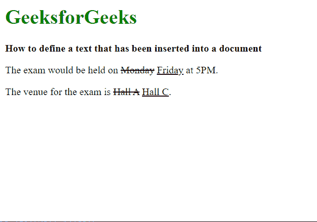

# 如何在 HTML5 中定义插入文档的文本元素？

> 原文:[https://www . geesforgeks . org/如何在 html5 中定义插入文档的文本元素/](https://www.geeksforgeeks.org/how-to-define-a-text-element-that-inserted-into-a-document-in-html5/)

在本文中，我们将学习如何定义插入到文档中的一些文本。这可用于显示文本内容的最新变化，并且主要用于要删除或过时的文本之后。

**进场:**

我们将使用 **< ins >** 元素来指定已经插入到文档中的文本。浏览器通常会在该标签中的文本上添加下划线，以区别于其他内容。这个元素有两个属性，可以用来指定引用和进行更改的时间。

**语法:**

```html
<ins> Inserted Iext& lt;/ins>
```

下面的例子说明了 **< ins >** 元素来定义已经插入到文档中的文本。

**示例:**

## 超文本标记语言

```html
<!DOCTYPE html>
<html>

<body>
    <h1 style="color: green;">
        GeeksforGeeks
    </h1>

    <b>
        How to define a text that has been
        inserted into a document
    </b>

    <!-- Simple usage of <ins> element -->
    <p>
        The exam would be held on <del>Monday</del>
        <ins>Friday</ins> at 5PM.
    </p>

    <!-- Using the <ins> element with the 
        cite and datetime attribute -->
    <p>
        The venue for the exam is <del>Hall A</del>
        <ins cite="https://www.geeksforgeeks.org" 
            datetime="2018-11-21T15:55:03Z">
            Hall C
        </ins>.
    </p>
</body>

</html>
```

**输出:**

