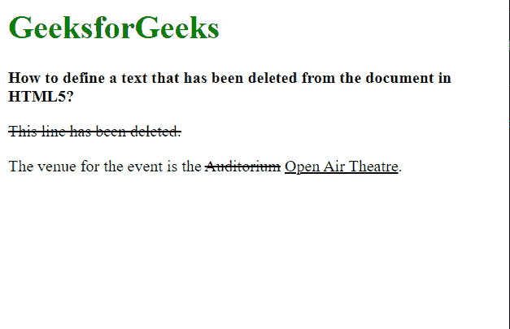

# 如何在 HTML5 中定义已经从文档中删除的文本？

> 原文:[https://www . geesforgeks . org/如何定义从 html5 文档中删除的文本/](https://www.geeksforgeeks.org/how-to-define-a-text-that-has-been-deleted-from-the-document-in-html5/)

在本文中，我们将学习如何定义从文档中删除的一些文本。

这可用于显示内容的最新更新或删除可能不正确的内容。后面通常是经过更新或更正的文本。

我们将使用**[<>](https://www.geeksforgeeks.org/html-del-tag/)**元素来指定已经从文档中删除的文本。浏览器通常会划掉这个标签中的文本，以区别于其他内容。这个元素有两个属性，可以用来指定引用和进行更改的时间。

**语法:**

```html
<del>Deleted text</del>
```

下面的例子说明了 **< del >** 元素来定义已经从文档中删除的文本。

**示例:**

## 超文本标记语言

```html
<html>
<body>
  <h1 style="color: green;">
    GeeksforGeeks
  </h1>

  <b>
    How to define a text that has
    been inserted into a document
  </b>

  <p><del>This line has been deleted.</del></p>
  <p>The venue for the event is the 
    <del cite="https://www.geeksforgeeks.org" 
         datetime="2018-11-21T15:55:03Z">
      Auditorium
    </del> <ins>Open Air Theatre</ins>.
  </p>

</body>
</html>
```

**输出:**



del 元素