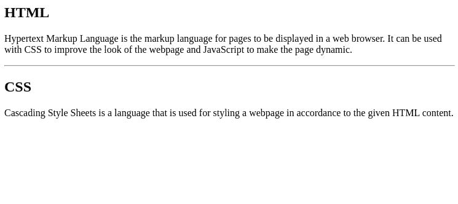
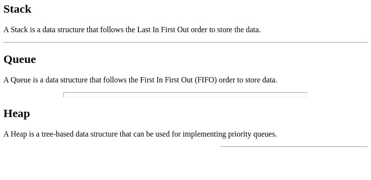

# 如何定义 HTML5 中内容的主题变化？

> 原文:[https://www . geeksforgeeks . org/如何定义主题内容变化 html5/](https://www.geeksforgeeks.org/how-to-define-a-thematic-change-in-the-content-in-html5/)

在本文中，我们将看到如何定义页面内容中的主题变化。当段落的描述改变时，这有助于在段落之间引入中断。

HTML 中的**[<【HR】>](https://www.geeksforgeeks.org/html-hr-tag/)**元素用于表示内容中的主题变化。它可以与对齐、阴影、宽度和大小等属性一起使用，以指定其特征。这是一个自结束标签。

以下示例显示了使用

* * *

标签来标记段落之间的主题变化:

**例 1:**

## 超文本标记语言

```html
<!DOCTYPE html>
<html>
<body>
    <h2>HTML</h2>

    <p>Hypertext Markup Language is the markup 
      language for pages to be displayed in a web 
      browser. It can be used with CSS to improve 
      the look of the webpage and JavaScript to make 
      the page dynamic.</p>

    <!-- Introducing a thematic break here -->
    <hr>

    <h2>CSS</h2>

    <p>Cascading Style Sheets is a language that is 
      used for styling a webpage in accordance to 
      the given HTML content.</p>

</body>
</html>
```

**输出:**



**例 2:**

## 超文本标记语言

```html
<!DOCTYPE html>
<html>
<body>
    <h2>Stack</h2>

    <p>A Stack is a data structure that follows
      the Last In First Out order to store the 
      data.</p>

    <!-- Normal HR element -->
    <hr>

    <h2>Queue</h2>
    <p>A Queue is a data structure that follows 
      the First In First Out (FIFO) order to 
      store data.</p>

    <!-- HR element with the size 
    and width modified -->
    <hr size="10" width="500">

    <h2>Heap</h2>

    <p>A Heap is a tree-based data structure that 
       can be used for implementing priority queues.</p>

    <!-- HR element with the alignment 
    and width modified -->
    <hr align="right" width="300">
</body>
</html>
```

**输出:**

