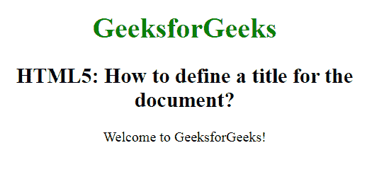

# 如何使用 HTML5 定义文档的标题？

> 原文:[https://www . geesforgeks . org/如何使用 html5 定义文档标题/](https://www.geeksforgeeks.org/how-to-define-a-title-for-a-document-using-html5/)

在本文中，我们将使用 **[<标题>标签](https://www.geeksforgeeks.org/html-title-tag/)** 来定义文档的标题。HTML 中的这个标签用于定义 HTML 文档的标题。它在浏览器工具栏中设置标题。当网页被添加到收藏夹时，它为网页提供标题。它在搜索引擎结果中显示页面的标题。

**语法:**

```html
<title> Title name </title>
```

**示例:**

```html
<!DOCTYPE html>
<html>

<head>
    <title>
        Define a title 
        for the document
    </title>

    <style>
        body {
            text-align: center;
        }

        h1 {
            color: green;
        }
    </style>
</head>

<body>
    <h1>GeeksforGeeks</h1>

    <h2>
        HTML5: How to define a
        title for the document?
    </h2>

    <p title="GeeksForGeeks">
        Welcome to GeeksforGeeks!
    </p>
</body>

</html>
```

**输出:**


**支持的浏览器:**

*   谷歌 Chrome
*   微软公司出品的 web 浏览器
*   火狐浏览器
*   歌剧
*   旅行队