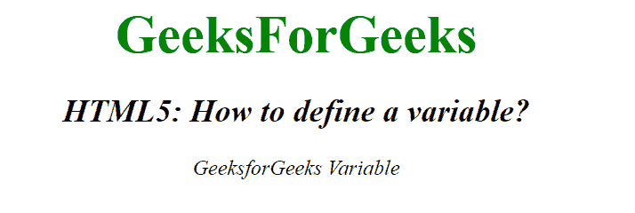

# 如何在 HTML5 中定义一个变量？

> 原文:[https://www . geesforgeks . org/如何定义 html5 中的变量/](https://www.geeksforgeeks.org/how-to-define-a-variable-in-html5/)

在本文中，我们通过使用文档中的 **[< var >标记](https://www.geeksforgeeks.org/html-var-tag/)** 来定义 HTML 中的一个变量。它是一个短语标签，用于指定数学方程或计算机程序中的变量。在大多数浏览器中，该标签的内容以斜体格式显示。

**语法:**

```html
<var> Contents... </var>
```

**示例:**

```html
<!DOCTYPE html>
<html>

<head>
    <title>
        How to define a
        variable in HTML5?
    </title>

    <style>
        body {
            text-align: center;
        }

        .gfg {
            font-size: 40px;
            font-weight: bold;
            color: green;
        }

        .geeks {
            font-size: 25px;
            font-weight: bold;
        }
    </style>
</head>

<body>
    <div class="gfg">GeeksForGeeks</div>

    <h2>
        <var>
            HTML5: How to define a variable?
        </var>
    </h2>

    <var>GeeksforGeeks Variable</var>
</body>

</html>
```

**输出:**


**支持的浏览器如下:**

*   谷歌 Chrome
*   微软公司出品的 web 浏览器
*   火狐浏览器
*   歌剧
*   旅行队