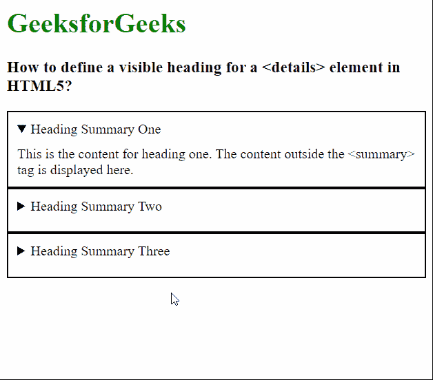

# 如何在 HTML5 中定义细节元素的可见标题？

> 原文:[https://www . geeksforgeeks . org/如何定义-一个-可见-标题-详细信息-html5 中的元素/](https://www.geeksforgeeks.org/how-to-define-a-visible-heading-for-details-element-in-html5/)

在本文中，我们将学习如何为 [***<元素定义一个可见的标题>***](https://www.geeksforgeeks.org/html5-details-tag/) 元素。该元素用于创建一个小部件，当它处于“*打开*状态时，显示信息。可以通过单击元素来切换状态。必须披露的内容包含在 ***<详细信息>*** 标签中。

**方法:**[***<摘要>***](https://www.geeksforgeeks.org/html-5-summary-tag/) 标签用于定义无论小部件状态如何都可见的标题。当 ***<的第一个子元素>*** 元素是 ***<汇总>*** 元素时，那么这个标签的内容就用来显示小部件的标签。

**语法:**

```html
<details>
  <!-- Define the heading to be displayed -->
  <summary>Heading Summary One</summary>
   This is the content for heading one.
</details>
```

**示例:**下面的示例说明了 ***<汇总>*** 标签来定义 ***<元素的标题>*** 元素。

## 超文本标记语言

```html
<html>
<head>
  <style>
    details {
      padding: 10px;
      border: 2px solid;
    }

    summary {
      cursor: pointer;
      outline: 0;
      padding-bottom: 10px;
    }
  </style>
</head>
<body>
  <h1 style="color: green;">
    GeeksforGeeks
  </h1>
  <h3>
    How to define a visible heading for
    a <details> element in HTML5?
  </h3>

  <!-- Define the <details> element -->
  <details open>

    <!-- Define the heading to be displayed -->
    <summary>Heading Summary One</summary>
    This is the content for heading one. The 
    content outside the <summary> tag
    is displayed here.
  </details>

  <!-- Define the <details> element -->
  <details>

    <!-- Define the heading to be displayed -->
    <summary>Heading Summary Two</summary>
    This is the content for heading two. The 
    content outside the <summary> tag 
    is displayed here.
  </details>

  <!-- Define the <details> element -->
  <details>

    <!-- Define the heading to be displayed -->
    <summary>Heading Summary Three</summary>
    This is the content for heading three. The
    content outside the <summary> tag 
    is displayed here.
  </details>
</body>
</html>
```

**输出:**



可见标题