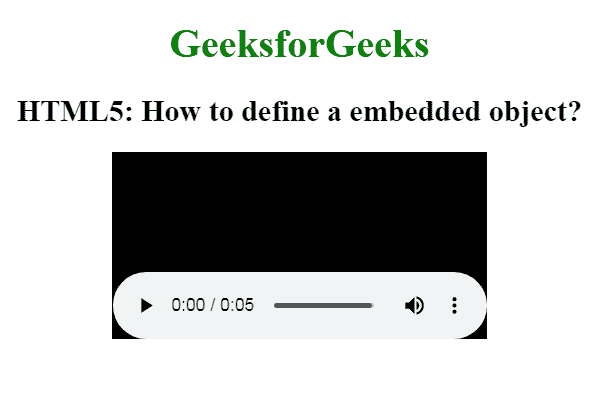

# 如何在 HTML5 中定义嵌入对象？

> 原文:[https://www . geesforgeks . org/如何定义 html5 中的嵌入式对象/](https://www.geeksforgeeks.org/how-to-define-an-embedded-object-in-html5/)

在本文中，您将学习如何使用文档中的 **<对象>** 元素来定义嵌入式对象。它用于在网页中显示多媒体对象，如音频、视频、图像、pdf 和 Flash。该元素还用于在 HTML 页面上显示任何其他网页。这个标签支持 HTML 的所有全局和事件属性。

**语法:**

```html
<object> ... </object>
```

**示例:**

```html
<!DOCTYPE html>
<html>

<head>
    <title>
        How to define an embedded 
        object in HTML5?
    </title>

    <style>
        body {
            text-align: center;
        }

        h1 {
            color: green;
        }
    </style>
</head>

<body>
    <h1>GeeksforGeeks</h1>

    <h2>
        HTML5: How to define 
        a embedded object?
    </h2>

    <object data=
"https://media.geeksforgeeks.org/wp-content/cdn-uploads/20200430164710/captured_voice.mp3">
    </object>
</body>

</html>
```

**输出:**



**支持的浏览器如下:** 

*   谷歌 Chrome
*   微软公司出品的 web 浏览器
*   火狐浏览器
*   歌剧
*   旅行队