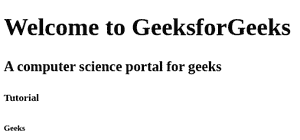

# 如何在 HTML5 中定义一个 HTML 标题？

> 原文:[https://www . geesforgeks . org/如何定义 html-in-html-heading 5/](https://www.geeksforgeeks.org/how-to-define-an-html-heading-in-html5/)

HTML 标题标签用于定义页面的标题。标题由

# 至

###### 标签定义。文本的大小取决于[标题标签](https://www.geeksforgeeks.org/html-5-header-tag/) **的类型。h1** 是最大的航向标， **h6** 是最小的航向标(h1>H2>H3>H4>H5>h6)。

**语法:**

```html
<h1></h1>
<h2></h2>
<h6></h6>
```

**例 1:**

## 超文本标记语言

```html
<!DOCTYPE html>
<html>

<body>
  <h1>Welcome to GeeksforGeeks </h1>
  <h2>A computer science portal for geeks</h2>
  <h5>Tutorial</h5>
  <h6>Geeks</h6>
</body>

</html>
```

**输出:**



**示例 2:** 每个 HTML 标题都有一个默认大小，但是用户可以更改其大小，如下所示。

## 超文本标记语言

```html
<!DOCTYPE html> 
<html> 

<body> 
  <h1 style="font-size:40px;">
     Welcome to GeeksforGeeks
  </h1> 
</body> 

</html>
```

**输出:**

