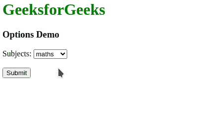
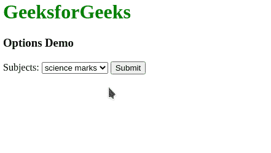

# 如何在 HTML5 的下拉列表中定义一个选项？

> 原文:[https://www . geesforgeks . org/如何定义选项下拉列表 html5/](https://www.geeksforgeeks.org/how-to-define-an-option-in-a-drop-down-list-in-html5/)

在本文中，我们将学习如何在 HTML5 的下拉列表中定义一个选项。<select>元素用于在 HTML 中创建下拉列表。这通常用于在表单中向用户呈现选项列表，以便用户可以选择一个选项作为所需选项。</select>

在<选择>元素中定义的 **[<选项>](https://www.geeksforgeeks.org/html-option-tag/)** 元素定义了下拉列表中可用的选项。该标签包含以下属性:

以下示例显示了如何在下拉列表中定义选项。

**示例 1:** 在本例中，主题在下拉列表中显示为选项。

## 超文本标记语言

```html
<html>
<body>
  <h1 style="color: green">
    GeeksforGeeks
  </h1>
  <h3>Options Demo</h3>
    <form>
      <label for="sub">Subjects: 
      </label>

      <!-- Specifying the select 
      element to be used -->
      <select name="sub" id="sub">

        <!-- Specifying the options to
         be available for selection -->
        <option value="maths">
          maths
        </option>
        <option value="science">
          science
        </option>
        <option value="social">
          social
        </option>
        <option value="hindi">
          hindi
        </option>
      </select>
      <br><br>
      <input type="submit" value="Submit">
  </form>
</body>
</html>
```

**输出:**



**示例 2:** 在本例中，使用下拉列表的选项中的 value 属性来指定主题的标记。

## 超文本标记语言

```html
<html>
<body>
  <h1 style="color: green">
    GeeksforGeeks
  </h1>
  <h3>Options Demo</h3>
  <form>
    <label for="sub">Subjects: 
    </label>

    <!-- Specifying the select 
    element to be used -->
    <select name="sub" id="marks">

      <!-- Specifying the options to 
      be available for selection
      along with numerical values -->
      <option value="98">
        maths marks
      </option>
      <option value="90">
        science marks
      </option>
      <option value="90">
        social marks
      </option>
      <option value="45">
        hindi marks
      </option>
    </select>

    <input type="submit" 
           value="Submit">
  </form>
</body>
</html>
```

**输出:**

