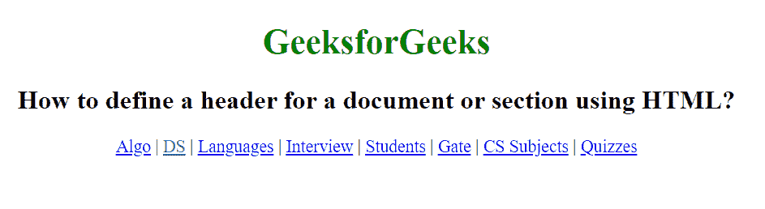

# 如何使用 HTML 为文档或章节定义页眉？

> 原文:[https://www . geeksforgeeks . org/如何使用 html 定义文档或部分的标题/](https://www.geeksforgeeks.org/how-to-define-header-for-a-document-or-section-using-html/)

HTML 中的

<header>标记用于定义文档或章节的标题。它包含与相关内容的标题和标题相关的信息。

<header>元素通常包含该部分的标题(h1-h6 元素或

<hgroup>元素)，但这不是必需的。</hgroup>

</header>

</header>

<header>元素也可以用于包装一个部分的目录、搜索表单或任何相关的徽标。

<header>标签是 HTML5 中的一个新标签，它需要一个开始标签和一个结束标签。</header>

</header>

一个文档中可以有多个

<header>元素。</header>

一个

<header>标签不能放在一个

<footer>、

<address>或另一个

<header>元素中。</header>

</address>

</footer>

</header>

**语法:**

```html
<header> Contents... </header>

```

**示例:**

## 超文本标记语言

```html
<!DOCTYPE html>
<html>

<head>
    <title>
        How to define a header for a document
        or section using HTML?
    </title>
    <style>
        h1 {
            color: green;
        }

        body {
            text-align: center;
        }
    </style>
</head>

<body>
    <header>
        <h1>GeeksforGeeks</h1>

        <h2>
            How to define a header for a document
            or section using HTML?
        </h2>

        <p>
            <a href="https://www.geeksforgeeks.org/fundamentals-of-algorithms/">
                Algo</a> |
            <a href="https://www.geeksforgeeks.org/data-structures/">
                DS</a> |
            <a href="https://www.geeksforgeeks.org/category/program-output/">
                Languages</a> |
            <a href="https://www.geeksforgeeks.org/company-interview-corner/">
                Interview</a> |
            <a href="https://www.geeksforgeeks.org/student-corner/">
                Students</a> |
            <a href="https://www.geeksforgeeks.org/gate-cs-notes-gq/">
                Gate</a> |
            <a href="https://www.geeksforgeeks.org/articles-on-computer-science-subjects-gq/">
                CS Subjects</a> |
            <a href="https://www.geeksforgeeks.org/quiz-corner-gq/">
                Quizzes</a>
        </p>

    </header>
</body>

</html>
```

**输出:**

