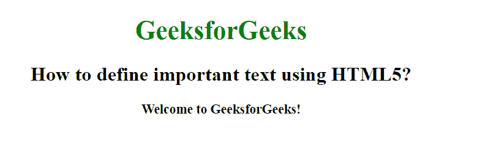

# 如何用 HTML5 定义重要文本？

> 原文:[https://www . geesforgeks . org/如何使用-html5 定义重要文本/](https://www.geeksforgeeks.org/how-to-define-important-text-using-html5/)

在本文中，我们通过在 HTML 中使用 [<强>标签](https://www.geeksforgeeks.org/html-strong-tag/)来定义一个重要的文本。它是经过解析的标记，用于显示文本的重要性。它将文本显示为粗体。

**语法:**

```html
<strong> Contents... </strong>
```

**例 1:**

```html
<!DOCTYPE html>
<html>

<head>
    <title>
        How to define important
        text in HTML?
    </title>

    <style>
        body {
            text-align: center;
        }

        h1 {
            color: green;
        }
    </style>
</head>

<body>
    <h1>GeeksforGeeks</h1>

    <h2>
        How to define important
        text using HTML5?
    </h2>

    <strong>
        Welcome to GeeksforGeeks!
    </strong>
</body>

</html>
```

**输出:**


**例 2:**

```html
<!DOCTYPE html>
<html>

<head>
    <title>
        How to define important
        text in HTML?
    </title>

    <style>
        body {
            text-align: center;
        }

        h1 {
            color: green;
        }

        .gfg {
            font-weight: bold;
        }
    </style>
</head>

<body>
    <h1>GeeksforGeeks</h1>

    <h2 class="gfg">
        How to define important
        text using HTML5?
    </h2>

    <div class="gfg">
        Welcome to GeeksforGeeks!
    </div>
</body>

</html>              
```

**输出:**


**支持的浏览器:**

*   谷歌 Chrome
*   微软公司出品的 web 浏览器
*   火狐浏览器
*   歌剧
*   旅行队