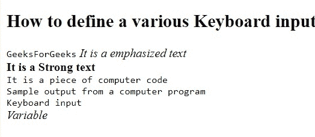
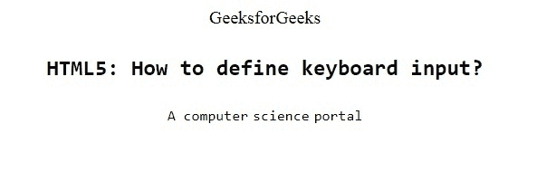

# 如何在 HTML5 中定义键盘输入？

> 原文:[https://www . geesforgeks . org/如何定义键盘输入 html5/](https://www.geeksforgeeks.org/how-to-define-keyboard-input-in-html5/)

短语标签用于定义键盘输入。由 [< kbd >标签](https://www.geeksforgeeks.org/html-kbd-tag/)包围的文本通常以浏览器的默认等间距字体显示。在本文中，我们使用各种类型的标签来定义键盘输入，如< kbd >、<代码>、< em >、< var >和< samp >。

**语法:**

```html
<kbd> Contents... </kbd> 
```

**例 1:**

```html
<!DOCTYPE html>
<html>

<head>
    <meta charset="utf-8" />
    <title>
        How to define keyboard input
    </title>
</head>

<body>
    <h2>
        How to define a various
        Keyboard input.
    </h2>

    <kbd>GeeksForGeeks</kbd>

    <em>It is a emphasized text</em>
    <br />

    <strong>
        It is a Strong text
    </strong>
    <br />

    <code>
        It is a piece of
        computer code
    </code>
    <br />

    <samp>
        Sample output from a computer program
    </samp>
    <br />

    <kbd>Keyboard input</kbd><br />
    <var>Variable</var>
</body>

</html>
```

**输出:**


**例 2:**

```html
<!DOCTYPE html>
<html>

<head>
    <title>
        How to define keyboard 
        input in HTML5?
    </title>

    <style>
        body {
            text-align: center;
        }
    </style>
</head>

<body>
    <div class="gfg">
        GeeksforGeeks
    </div>

    <h2>
        <kbd>
            HTML5: How to define 
            keyboard input?
        </kbd>
    </h2>

    <kbd>A computer</kbd>
    <kbd>science</kbd>
    <kbd>portal</kbd>
</body>

</html>  
```

**输出:**


**支持的浏览器:**

*   谷歌 Chrome
*   微软公司出品的 web 浏览器
*   火狐浏览器
*   歌剧
*   旅行队