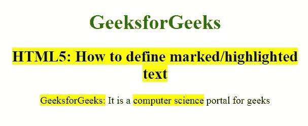

# 如何用 HTML5 定义标记/高亮文本？

> 原文:[https://www . geesforgeks . org/如何定义-标记-高亮-文本-使用-html5/](https://www.geeksforgeeks.org/how-to-define-marked-highlighted-text-using-html5/)

在文章中，我们定义了一个标记/高亮的 tex 通过使用**标记**标签在 HTML 中用来定义标记的文本。它用于突出段落中的文本部分。标记标签在 HTML 5 中是新的。

**语法:**

```html
<mark> Contents... </mark> 
```

**示例:**

```html
<!DOCTYPE html> 
<html> 
    <head> 
        <title>How to define marked/highlighted text</title> 

        <style> 
            body { 
                text-align:center; 
            } 
            h1 { 
                color:green; 
            } 
        </style> 
    </head> 
    <body> 
        <h1>GeeksforGeeks</h1> 
        <h2><mark>HTML5: How to define marked/highlighted text
</mark></h2> 

        <p> 
            <mark>GeeksforGeeks:</mark> 
            It is a 
            <mark>computer science</mark> 
            portal for geeks 
        </p> 
    </body> 
</html> 
```

**输出:**


**支持的浏览器如下:**

*   谷歌 Chrome
*   微软公司出品的 web 浏览器
*   火狐浏览器
*   歌剧
*   旅行队