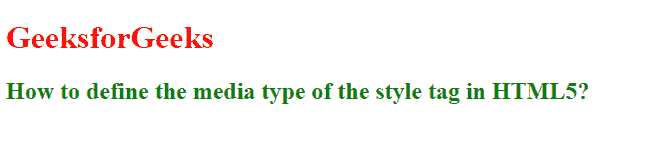
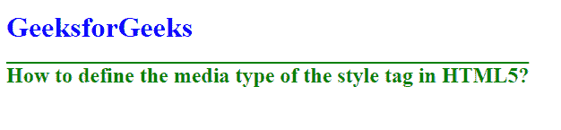

# 如何在 HTML5 中定义样式标签的媒体类型？

> 原文:[https://www . geesforgeks . org/如何定义媒体类型-html5 中的样式标签/](https://www.geeksforgeeks.org/how-to-define-media-type-of-style-tag-in-html5/)

在本文中，我们学习如何在 HTML5 中定义样式标签的媒体类型。

**方法:**使用 [*<样式>*](https://www.geeksforgeeks.org/html-style-tag/) 元素的属性就可以简单的完成任务。它用于指定特定设备的样式，如打印媒体或语音。这个属性可以接受几个值。

**语法:**

```html
<style media="value">
```

**HTML 代码:**下面的代码说明了定义 HTML5 中样式标签的媒体类型的媒体属性。下面的代码指定了屏幕和打印媒体设备的样式。

## 超文本标记语言

```html
<!DOCTYPE html>
<html>

<head>
    <style type="text/css" media="screen">
        .heading {
            color: red;
        }

        h2 {
            color: green;
            font-weight: bold;
        }
    </style>

    <style type="text/css" media="print">
        .heading {
            color: blue;
        }

        h2 {
            color: green;
            font-weight: bold;
        }
    </style>
</head>

<body>
    <h1 class="heading">
        GeeksforGeeks
    </h1>

    <h2>
        How to define the media type 
        of the style tag in HTML5?
    </h2>
</body>

</html>
```

**输出:**

*   **屏幕版输出:**
    

    屏幕版本

*   **打印版输出:**
    

    打印版本