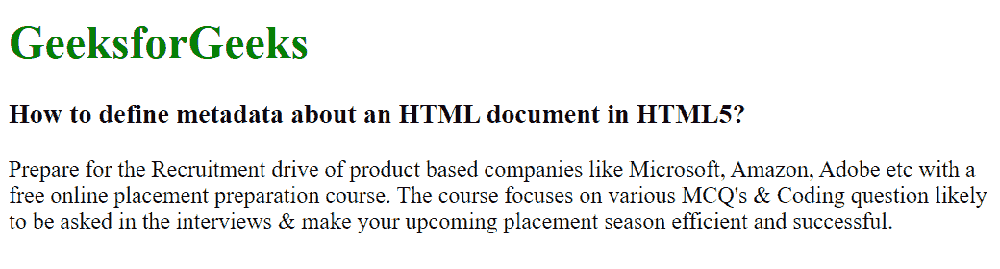

# 如何在 HTML5 中定义关于一个 HTML 文档的元数据？

> 原文:[https://www . geesforgeks . org/how-to-define-metadata-about-an-html-document-in-html 5/](https://www.geeksforgeeks.org/how-to-define-metadata-about-an-html-document-in-html5/)

元数据意味着关于数据的信息。HTML 中的标签提供了关于 HTML 文档的信息，或者简单的说，它提供了关于文档的重要信息。这些标签基本上是用来添加名称/值对来描述 HTML 文档的属性，比如截止日期、作者姓名、关键词列表、文档作者等。

在本文中，我们将看到如何通过使用 [HTML <元>标签](https://www.geeksforgeeks.org/html-meta-tag/)来设置关于一个 HTML 文档的元数据。

**语法:**

```html
<meta attribute-name="value">
```

**示例:**

## 超文本标记语言

```html
<!DOCTYPE html>
<html>

<head>
    <title>
        How to define metadata about 
        an HTML document in HTML5? 
    </title>

    <meta charset="utf-8">
    <meta charset="utf-8" name="viewport" 
          content="width=device-width, initial-scale=1.0">
</head>

<body>
    <h1 style="color: green;">
        GeeksforGeeks
    </h1>

    <h3>
        How to define metadata about 
        an HTML document in HTML5? 
    </h3>
    <p>
        Prepare for the Recruitment drive
        of product based companies like
        Microsoft, Amazon, Adobe etc with
        a free online placement preparation
        course. The course focuses on various
        MCQ's & Coding question likely
        to be asked in the interviews &
        make your upcoming placement season
        efficient and successful.
    </p>

</body>

</html>
```

**输出:**

