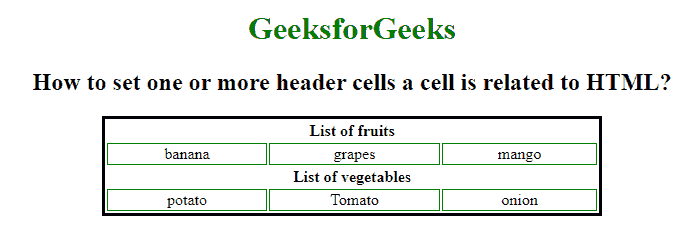

# 如何在 HTML 中定义一个单元格相关的一个或多个表头单元格？

> 原文:[https://www . geesforgeks . org/如何定义一个或多个标题单元格-一个单元格与 html 中的单元格相关/](https://www.geeksforgeeks.org/how-to-define-one-or-more-header-cells-a-cell-is-related-to-in-html/)

本文旨在向与 HTML 相关的单元格添加一个或多个标题单元格。

**方法:**这可以通过使用 HTML 文档中的 [**标题**](https://www.geeksforgeeks.org/html-headers-attribute/) 属性，同时使用[<【TD】>](https://www.geeksforgeeks.org/html-td-tag/)和[<>](https://www.geeksforgeeks.org/html-th-tag/)标记来完成。它包含值 *header_id* ，该值指定与表格标题单元格相关的一个或多个标题单元格的 id 分隔列表的空间。

**语法:**

```html
<td headers="header_id"> Content..</td>
```

**示例:**

## 超文本标记语言

```html
<!DOCTYPE html>
<html>

<head>
    <!-- style to set border -->
    <style>
        table {
            border: 3px solid black;
        }

        td {
            border: 1px solid green;
            text-align: center;
        }
    </style>
</head>

<body>
    <center>
        <h1 style="color:green;">
            GeeksforGeeks
        </h1>

        <h2>
            How to set one or more header 
            cells a cell is related to HTML?
        </h2>

        <table style="width:500px">
            <tr>
                <th id="fruits" colspan="3">
                    List of fruits
                </th>
            </tr>

            <tr>
                <td Headers="fruits">banana</td>
                <td Headers="fruits">grapes</td>
                <td Headers="fruits">mango</td>
            </tr>
            <tr>
                <th id="vegetables" colspan="3">
                    List of vegetables
                </th>
            </tr>
            <tr>
                <td Headers="vegetables">potato</td>
                <td Headers="vegetables">Tomato</td>
                <td Headers="vegetables">onion</td>
        </table>
    </center>
</body>

</html>
```

**输出:**



**支持的浏览器:**

*   谷歌 Chrome
*   微软公司出品的 web 浏览器
*   火狐浏览器
*   苹果 Safari
*   歌剧