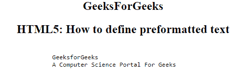
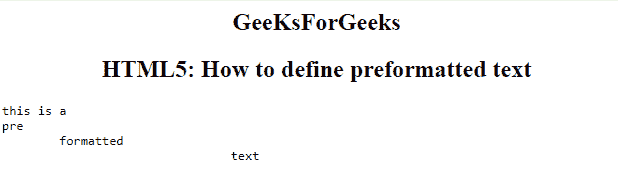

# 如何用 HTML 定义预格式化文本？

> 原文:[https://www . geesforgeks . org/如何定义-预格式化-文本-使用-html/](https://www.geeksforgeeks.org/how-to-define-preformatted-text-using-html/)

在本文中，我们通过使用文档中的 **[< pre >标签](https://www.geeksforgeeks.org/html-pre-tag/)** 来定义 HTML 中的预格式化文本。它用于定义预格式化文本块，保留文本空格、换行符、制表符和其他被网络浏览器忽略的格式化字符。 **pre** 标签中的文本以固定宽度字体显示，但可以使用 CSS 进行更改。**前置**标签需要一个开始和结束标签。

**语法:**

```html
<pre> Contents... </pre>
```

**例 1:**

```html
<html> 
    <head> 
        <title>HTML5: How to define preformatted text?
</title> 
<style>
    h2
    {
        Text-align:center;
    }
</style>
    </head> 
    <body> 
    <h2>GeeKsForGeeks</h2>
    <h2>HTML5: How to define preformatted text
</h2>
        <pre> 
            GeeksforGeeks 
            A Computer Science Portal For Geeks 
        </pre> 
    </body> 
</html>                     
```

**输出:**


**例 2:**

```html
<html> 
    <head> 
        <title>HTML5: How to define preformatted text?
</title> 
<style>
    h2
    {
        Text-align:center;
    }
</style>
    </head> 
    <body> 
    <h2>GeeKsForGeeks</h2>
    <h2>HTML5: How to define preformatted text
</h2>
        <pre>
this  is  a   
pre   
     formatted   
                  text
</pre>
    </body> 
</html>                     
```

**输出:**


**支持的浏览器如下:**

*   谷歌 Chrome
*   微软公司出品的 web 浏览器
*   火狐浏览器
*   歌剧
*   旅行队