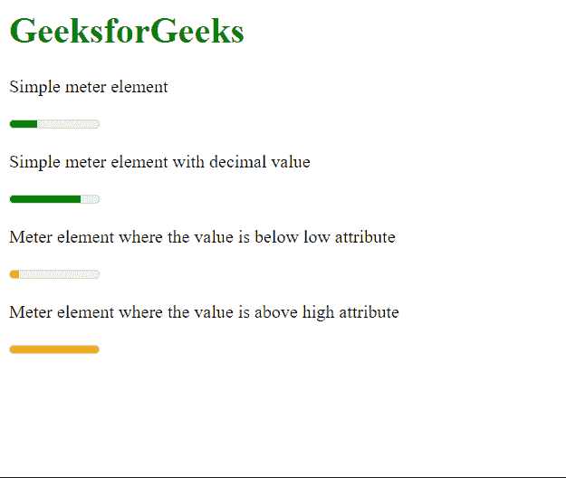

# 如何在 HTML5 中定义给定范围内的标量测量？

> 原文:[https://www . geeksforgeeks . org/如何在给定范围内定义标量测量 html5/](https://www.geeksforgeeks.org/how-to-define-scalar-measurement-within-a-given-range-in-html5/)

在本文中，我们将学习如何定义一个在已知范围内具有标量度量的元素。它可以用来表示仪表中的分数数据，使读者容易理解这些值。

**进场:**

我们将使用<meter>元素来定义可以测量标量值的仪表。此元素具有可用于定义要表示的值、范围的下限和上限以及首选值范围的属性。血糖仪的颜色根据其代表的值和浏览器样式而变化。</meter>

**语法:**

```html
<meter value="" min="" max=""></meter>
```

以下示例说明了定义标量测量的<meter>元素。</meter>

**示例:**

## 超文本标记语言

```html
<!DOCTYPE html>
<html>

<body>
    <h1 style="color: green;">
        GeeksforGeek
    </h1>

    <p>Simple meter element</p>
    <meter value="3" min="0" max="10" 
        low="1" high="8">
    </meter>

    <p>Simple meter element with decimal value</p>
    <meter value="0.8" min="0" max="1"></meter>

    <p>
        Meter element where the value is
        below low attribute
    </p>

    <meter value="1" min="0" max="10" 
        low="3" high="9">
    </meter>

    <p>
        Meter element where the value is
        above high attribute
    </p>

    <meter value="10" min="0" max="10" 
        low="3" high="9">
    </meter>
</body>

</html>
```

**输出:**

